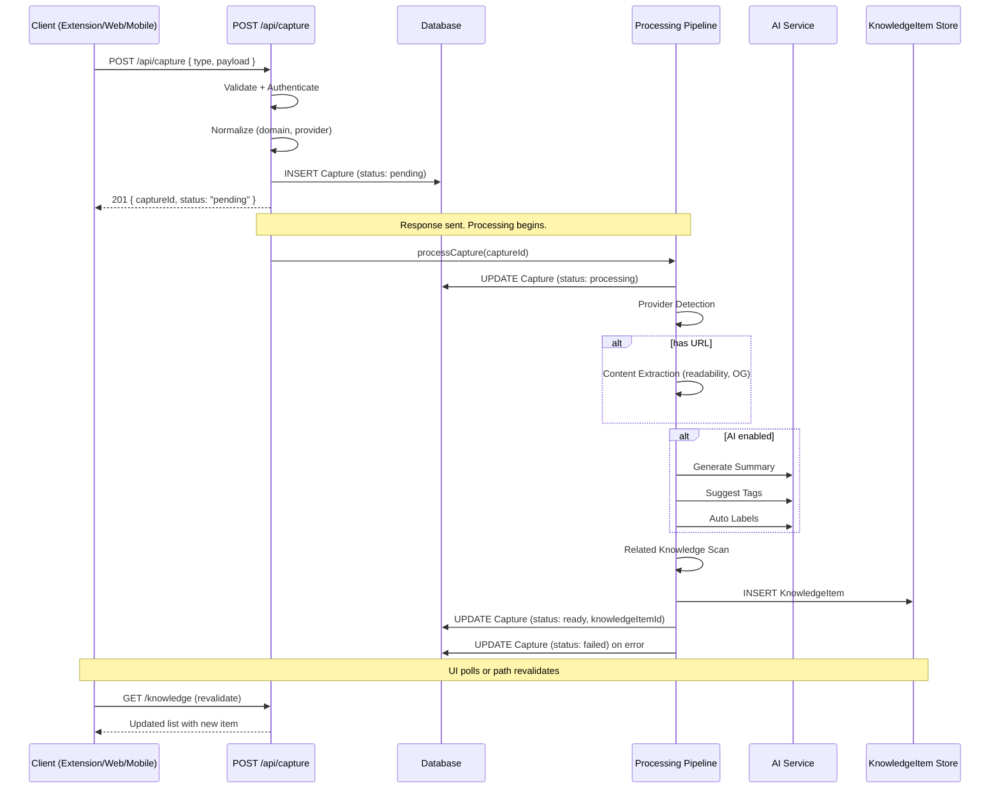
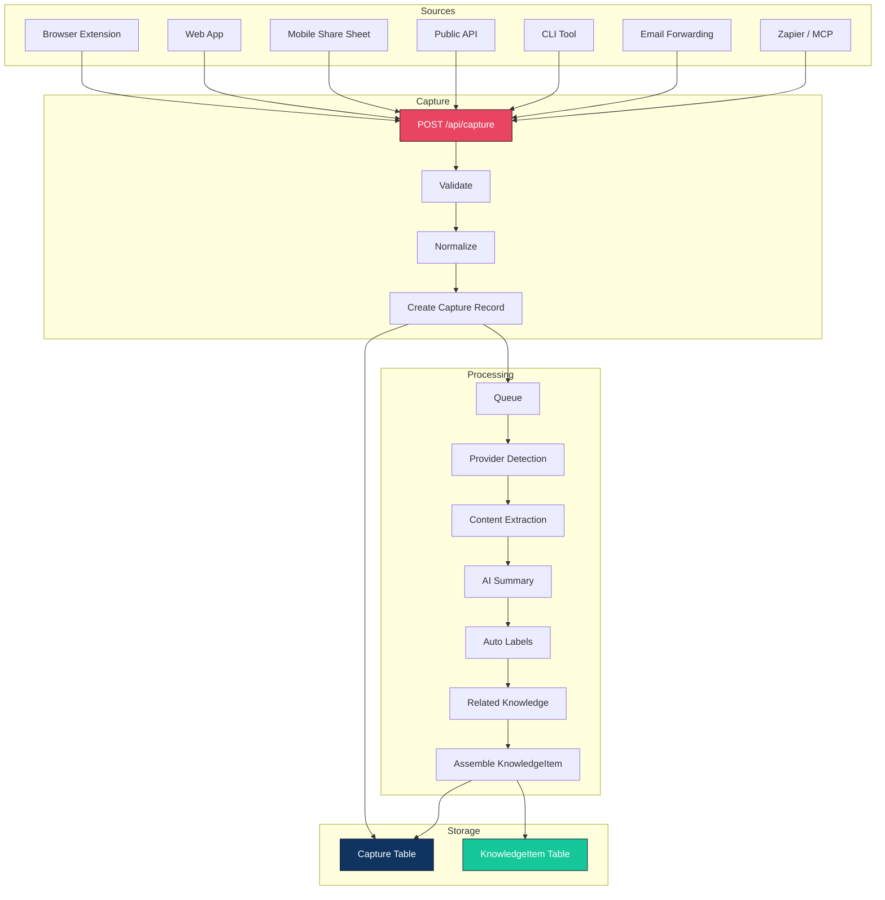

# Capture Architecture

## Why Capture Exists

Every feature in Devventory begins with a user saving something. Today that path is fractured:

- The browser extension sends to `/api/ext/capture` or `/api/ext/save-resource` or `/api/ext/save-note`
- The web app routes through `createKnowledgeItem` in `actions/knowledge.ts`
- The sidebar empty-state prompt goes through a URL param `quickCapture`
- The import action bulk-creates `KnowledgeItem` records directly

Each path validates differently, enriches differently (or not at all), and writes to the same model with no provenance. Capture logic is **mixed into** knowledge actions, API routes, client components, and the database schema.

Capture exists as a separate subsystem to make the ingest path explicit, observable, and extensible. Every external input — whether from a browser extension, mobile share sheet, CLI, email, or API — follows the same pipeline. The user gets one mental model ("I'm saving something important") and the system gets one entry point.

---

## Core Principles

| Principle | Meaning |
|---|---|
| **Single entry point** | Every capture source uses `POST /api/capture`. No duplicate endpoints. |
| **Capture is transient** | Capture records represent a request in flight. Knowledge is the permanent artifact. |
| **Instant response** | Return to the user before heavy processing starts. Never block on AI enrichment. |
| **Provenance** | Every KnowledgeItem knows which Capture created it and from what source. |
| **Modular processing** | Each enrichment step is an independent processor. Add or remove steps without touching the pipeline. |

---

## Mental Model Shift

```
Before

User → Knowledge Item
       (mix of capture + knowledge, no provenance)

After

User → Capture → Processing → Knowledge Item → Collections → Reader → Search
       (transient)  (async)     (permanent)
```

Capture is now the **entry point** of the entire application. Processing is a **pipeline** of independent steps. Knowledge is a **permanent** artifact consumed by readers, collections, and search.

---

## Current Architecture Audit

Before designing the new system, here is every place where capture logic is currently mixed with knowledge logic.

| # | Location | Severity | What's Mixed |
|---|---|---|---|
| 1 | `actions/knowledge.ts:createKnowledgeItem` | **HIGH** | Server action used by both capture (URL param, extensions, import) and knowledge (inline creation). No provenance tracking. |
| 2 | `prisma/schema.prisma:KnowledgeItem` | **HIGH** | Single model stores capture artifacts (`url`, `canonicalUrl`, `domain`, `provider`, `thumbnail`, `favicon`) alongside knowledge fields (`content`, `notes`, `summary`). |
| 3 | `knowledge-workspace.tsx:51-61` | MEDIUM | Client component intercepts `quickCapture` URL param and calls capture action. Knowledge workspace doubles as capture ingestion point. |
| 4 | `sidebar.tsx:80-87` | MEDIUM | Capture initiation via `prompt()` + URL param routes through the knowledge page. |
| 5 | `resource-list.tsx:196-203` | LOW | Empty state "Capture" button duplicates the prompt+URL pattern. |
| 6 | `actions/import.ts` | MEDIUM | Bulk import creates KnowledgeItems directly without going through the capture pipeline. |
| 7 | `api/ext/capture/route.ts` | LOW | Pure capture endpoint but writes directly to KnowledgeItem with no intermediate Capture record. |
| 8 | `api/ext/save-resource/route.ts` | LOW | Duplicate capture endpoint (should merge into `/api/capture`). |
| 9 | `api/ext/save-note/route.ts` | LOW | Duplicate capture endpoint (should merge into `/api/capture`). |

The fix for each is addressed in the new architecture below.

---

## Capture Lifecycle

Every capture request flows through these stages:


### Stage Details

| Stage | Sync/Async | Responsibility |
|---|---|---|
| Receive | Sync | Parse request body, authenticate |
| Validate | Sync | Check required fields, validate types, enforce limits |
| Normalize | Sync | Sanitize input, extract domain from URL, detect provider |
| Create Capture Record | Sync | Persist Capture with status `pending` |
| Return 201 | Sync | Respond to client immediately with `captureId` |
| Queue Processing | Sync | Start async processing (fire-and-forget or queue) |
| Processing Pipeline | **Async** | Run enrichment steps, create KnowledgeItem |
| KnowledgeItem Ready | Async | Capture.status → `ready`, UI updates via poll/revalidate |

---

## Sequence Diagram



---

## Request Flow



Every source sends to `POST /api/capture`. The pipeline never knows which source sent the request.

---

## Processing Pipeline

```mermaid
flowchart LR
    subgraph Pipeline
        direction TB
        N[Normalization<br/>sanitize, truncate, format]
        M[Metadata Extraction<br/>domain, provider, OG tags]
        PD[Provider Detection<br/>YouTube, GitHub, generic]
        CE[Content Extraction<br/>readability, transcript]
        AI[AI Enrichment<br/>summary, tags, labels]
        RK[Related Knowledge<br/>backlink scan, similarity]
        SAVE[Save KnowledgeItem<br/>store + link to Capture]
    end

    N --> M --> PD --> CE --> AI --> RK --> SAVE
    
    style N fill:#1a1a2e,stroke:#e94560
    style AI fill:#1a1a2e,stroke:#e94560
    style SAVE fill:#1a1a2e,stroke:#16c79a
```



### Processor Contract

Every processor is an independent function:

```typescript
interface Processor<T> {
  name: string;                    // Unique identifier
  phase: "pre" | "enrich" | "post"; // Execution phase
  run(context: ProcessingContext): Promise<ProcessingContext>;
}

interface ProcessingContext {
  capture: Capture;
  metadata: Record<string, unknown>;  // Accumulated processor output
  errors: ProcessorError[];
}
```

### Processor Registry

Processors are registered in order. Adding a new processor means adding it to the registry — no pipeline code changes.

```typescript
const registry: Processor[] = [
  domainExtractor,       // pre: extract domain from URL
  providerDetector,      // pre: detect YouTube/GitHub/etc.
  ogScraper,             // pre: scrape OG tags
  contentExtractor,      // pre: readability extraction
  aiSummarizer,          // enrich: generate summary
  tagSuggestor,          // enrich: suggest tags
  labelGenerator,        // enrich: auto-categorize
  relatedScanner,        // post: find related items
  knowledgeAssembler,    // post: create KnowledgeItem
];
```

---

## Capture Model

```prisma
model Capture {
  id          String        @id @default(cuid())
  userId      String
  source      String        // "extension" | "web" | "mobile" | "api" | "import" | "cli" | "email"
  type        String        // "reference" | "note" | "document"
  status      CaptureStatus @default(pending)

  // Original request payload (normalized)
  payload     Json

  // Processing
  steps       StepRecord[]  // Completed processing steps with timestamps
  error       String?       // Failure reason
  retries     Int           @default(0)

  // Result
  knowledgeItemId String?
  knowledgeItem   KnowledgeItem? @relation(fields: [knowledgeItemId], references: [id])

  createdAt DateTime @default(now())
  updatedAt DateTime @updatedAt

  user User @relation(fields: [userId], references: [id])

  @@index([userId, status])
  @@index([createdAt])
}

enum CaptureStatus {
  pending
  processing
  ready
  failed
}

type StepRecord {
  name      String
  status    String   // "running" | "done" | "error"
  startedAt DateTime
  endedAt   DateTime?
  error     String?
}
```

### Why Transient

- Capture records can be deleted after 30 days without losing data
- Processing state is observable (users see "generating summary...")
- Failed captures are debuggable (full payload + error + step trace)
- Retry is safe (re-run pipeline on the same payload)

---

## KnowledgeItem Separation

### Fields to Remove from KnowledgeItem

These are capture-only artifacts that belong in the Capture payload or derived metadata:

| Field | Move To | Reason |
|---|---|---|
| `canonicalUrl` | Capture payload | Dedup logic runs only during capture |
| `thumbnail` | `Attachment` model | OG image is an attachment, not a core field |
| `favicon` | `Attachment` model | Same as thumbnail |
| `provider` | KnowledgeItem.metadata | Type-specific detail, not first-class |

### Fields to Keep on KnowledgeItem

| Field | Why It Belongs |
|---|---|
| `type` | Core classification for reader selection |
| `title` | Displayed everywhere (lists, search, backlinks) |
| `url` | Essential for reference display (reader, item, open original) |
| `domain` | Shown in metadata for link-type items |
| `content` | Primary body for notes/documents |
| `notes` | Personal annotations — pure knowledge |
| `summary` | AI enrichment result — consumed by reader |
| `tags` | Organization — consumed by search and filters |
| `metadata` | Type-specific extras (video duration, repo stars, etc.) |

### Provenance Link

Every KnowledgeItem gets a `captureId` field linking back to its originating Capture. This enables:

- Tracking where data came from
- Debugging enrichment failures
- Auditing ingestion patterns

---

## Failure States

| Failure | What Happens | User Sees |
|---|---|---|
| Invalid payload | 400 response, Capture not created | Error toast |
| Auth failure | 401 response | "Sign in to save" |
| DB write fails | Capture.status → `failed`, error logged, 500 returned | "Failed to save" toast |
| AI enrichment fails | Processor error logged, Capture.status → `ready` (best-effort), no summary/tags | Item appears without AI metadata |
| Content extraction fails | Processor skipped, Capture retains partial payload | Item saved without extracted content |
| Processing timeout | Capture.status → `failed` after timeout | "Processing timed out" with retry option |
| Pipeline crash mid-process | Capture.status stays `processing`, recovery job resets stale entries | Item shows loading state |

### Recovery

Stale `processing` captures (no update for >5 minutes) are reset to `pending` by a scheduled job. A manual retry endpoint (`POST /api/capture/:id/retry`) re-runs the pipeline.

---

## API Design

### Primary Endpoint

```http
POST /api/capture
Content-Type: application/json
Authorization: Bearer <session-or-api-key>

{
  "source": "extension",          // Who sent this
  "type": "reference",            // reference | note | document
  "payload": {
    "url": "https://example.com",
    "title": "Page Title",
    "selectedText": "...",
    "note": "Why I saved this"
  },
  "collectionIds": ["col_1"]      // Optional: file into collections
}
```

### Response

```http
201 Created

{
  "captureId": "cap_abc123",
  "status": "pending",
  "knowledgeItemId": null         // Populated after processing
}
```

### Payload Shapes

```typescript
// Reference (web page, GitHub, YouTube, etc.)
interface ReferencePayload {
  url: string;
  title?: string;
  selectedText?: string;
  note?: string;
}

// Note (quick thought, text)
interface NotePayload {
  content: string;
  title?: string;
}

// Document (file upload)
interface DocumentPayload {
  fileName: string;
  fileType: string;
  content: string;       // Extracted text
  note?: string;
}
```

### Status Check

```http
GET /api/capture/:id/status

{
  "captureId": "cap_abc123",
  "status": "ready",              // pending | processing | ready | failed
  "knowledgeItemId": "ki_xyz789",
  "steps": [
    { "name": "provider-detect", "status": "done", "startedAt": "...", "endedAt": "..." },
    { "name": "ai-summary", "status": "done", "startedAt": "...", "endedAt": "..." },
    { "name": "auto-labels", "status": "done", "startedAt": "...", "endedAt": "..." }
  ]
}
```

---

## Responsibilities

### Capture Subsystem

```
Validation         → Required fields, type checks, size limits
Authentication     → Session or API key verification
Normalization      → Sanitize input, extract domain/provider
Queueing           → Create Capture record, trigger async pipeline
Status tracking    → Update Capture.status, store step records
Error handling     → Log failures, support retry
```

### Knowledge Subsystem

```
Reading            → Fetch items, paginate, filter
Editing            → Modify title/content/notes/tags
Searching          → Full-text search across fields
Collections        → Organize items into groups
Backlinks          → Find items mentioning this title
Display            → Reader templates per type
```

### What Must NOT Happen

- Capture must not read or edit KnowledgeItem directly
- Knowledge must not validate external input
- Capture must not depend on reader templates
- Knowledge must not depend on processing pipeline

---

## Future Expansion

### New Capture Sources

Adding a new source requires only:

1. Client sends `POST /api/capture` with the appropriate payload
2. Optionally add a `source` identifier for analytics
3. No server-side changes unless the payload introduces new types

### New Processing Steps

Add a processor to the registry:

```typescript
const languageDetector: Processor = {
  name: "language-detect",
  phase: "pre",
  async run(ctx) {
    const lang = detectLanguage(ctx.metadata.content);
    ctx.metadata.language = lang;
    return ctx;
  },
};

registry.push(languageDetector);
```

No pipeline code changes. Processors are iterated in registration order.

### New Content Types

Adding a new type (e.g., `bookmark`, `recipe`, `code-snippet`) requires:

1. Add the type string to the KnowledgeItem type enum
2. Create a reader template for the new type
3. Optionally add a provider detector for specialized metadata
4. No changes to the capture pipeline

---

## Migration Plan

### Phase 1 — Audit (done)

Identify every place where capture logic mixes with knowledge logic.

### Phase 2 — Model Separation

- Create `Capture` model in Prisma
- Add `captureId` to `KnowledgeItem`
- Remove `canonicalUrl`, `thumbnail`, `favicon` from `KnowledgeItem`
- Run migration

### Phase 3 — Unified API Endpoint

- Create `POST /api/capture`
- Deprecate `/api/ext/capture`, `/api/ext/save-resource`, `/api/ext/save-note`
- Wire processing pipeline (synchronous MVP first, async later)

### Phase 4 — Wire Sources

- Update browser extension to use `/api/capture`
- Update web app quick capture to use `/api/capture`
- Update import action to use `/api/capture`
- Remove `quickCapture` URL param from workspace

### Phase 5 — Async Pipeline

- Implement async processing with queue
- Add status polling to client
- Add retry endpoint
- Add stale-capture recovery job

### Phase 6 — Cleanup

- Delete old extension endpoints
- Remove `createKnowledgeItem` from actions/knowledge.ts (replace with internal pipeline function)
- Remove capture-only fields from KnowledgeItem
- Deprecate old extension client code

---

## Open Questions

| Question | Decision Needed |
|---|---|
| Should `thumbnail` and `favicon` become `Attachment` records or stay in `KnowledgeItem.metadata`? | Prefer `Attachment` — cleaner separation, supports multiple images |
| Should the processing pipeline run in-process (MVP) or use a job queue? | MVP: in-process with fire-and-forget. Production: queue (Bull/Inngest) |
| Should `canonicalUrl` dedup block duplicate captures or warn? | Warn + link to existing item (notify, don't block) |
| How long should Capture records be retained? | 30 days after `ready` status, then delete |
| Should the status endpoint be public or require auth? | Require auth (same session/key as capture) |
