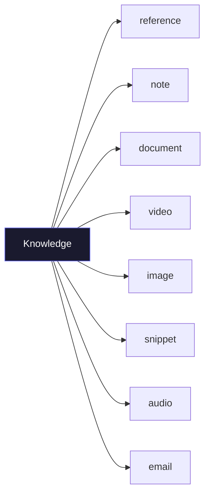
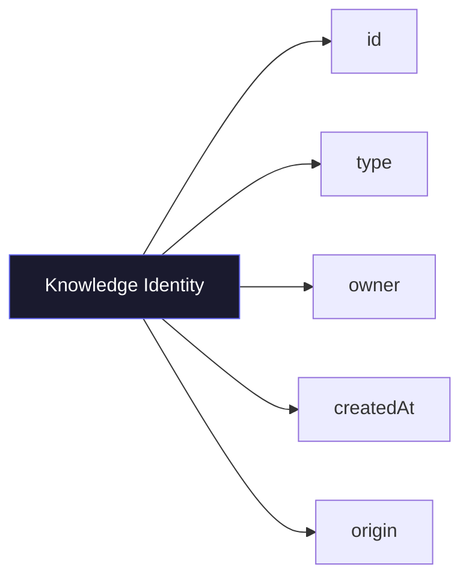
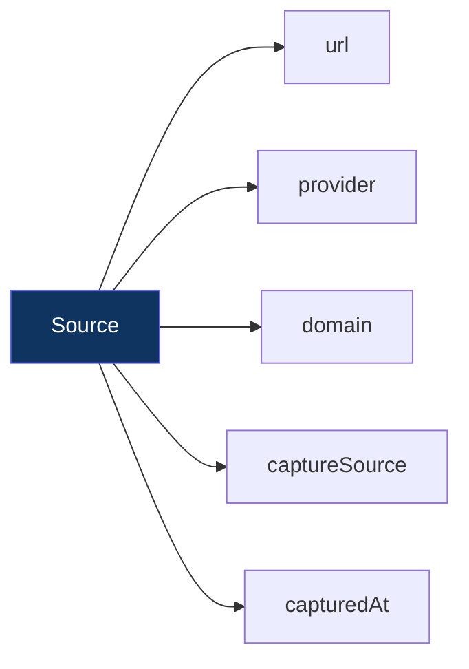
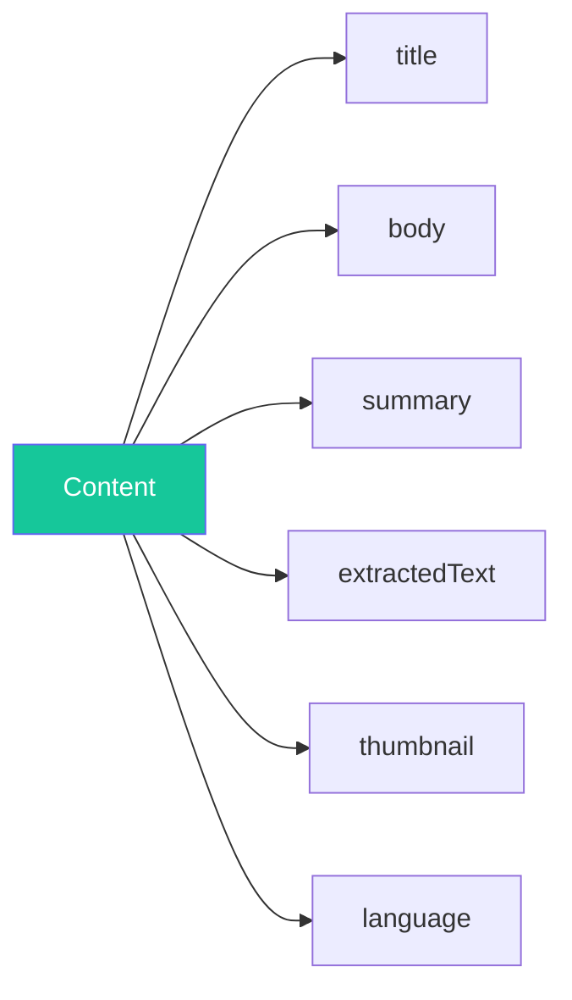
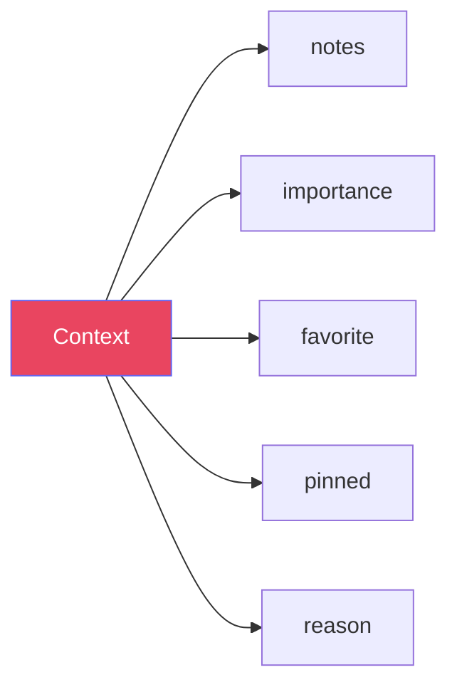
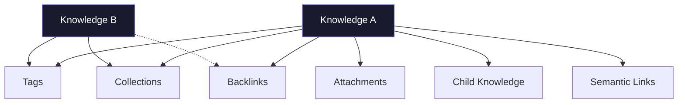
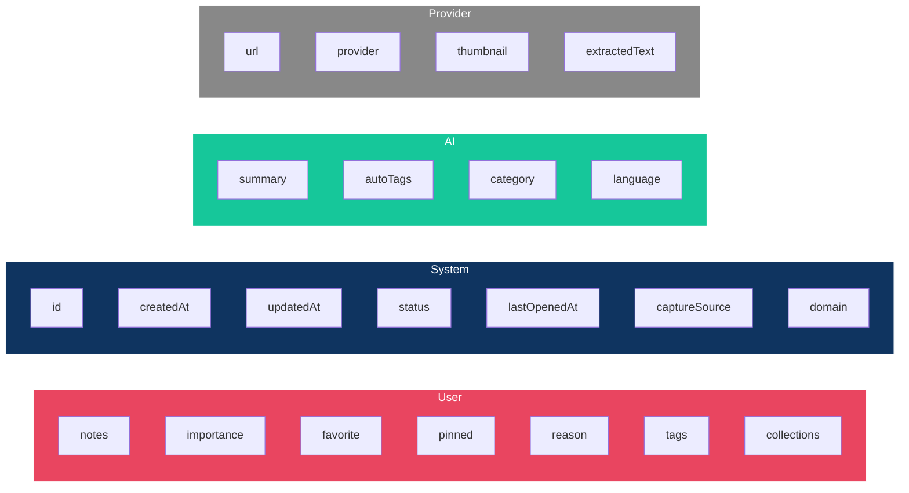
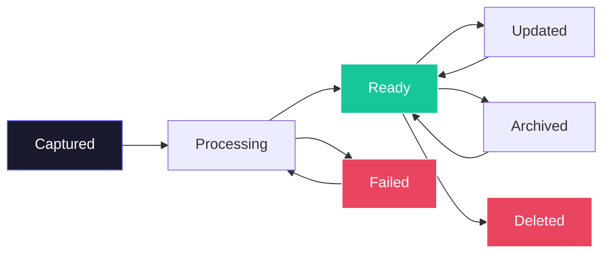
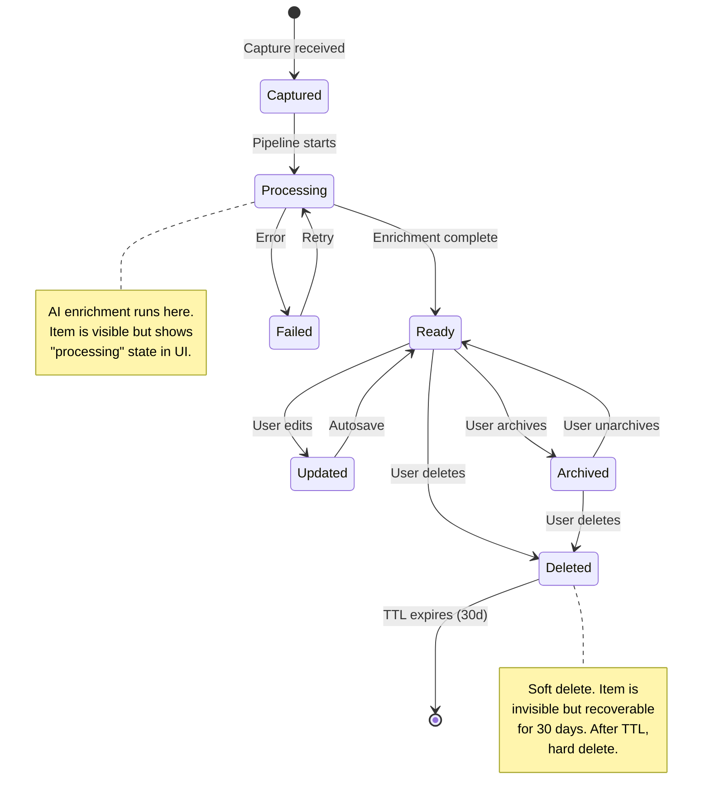

# RFC-001: Knowledge Domain Model

**Status:** Draft
**Author:** Devventory Architecture
**Date:** 2026-07-09
**Supersedes:** All prior implicit models (Resource, Note, Prompt, Project as separate entities)

---

## Table of Contents

1. [Objective](#objective)
2. [First Principles](#first-principles)
3. [What Knowledge Is](#what-knowledge-is)
4. [What Knowledge Is Not](#what-knowledge-is-not)
5. [Core Entity](#core-entity)
6. [Knowledge Types](#knowledge-types)
7. [Identity](#identity)
8. [Source](#source)
9. [Content](#content)
10. [Context](#context)
11. [Relationships](#relationships)
12. [Ownership](#ownership)
13. [Lifecycle](#lifecycle)
14. [State Machine](#state-machine)
15. [Invariants](#invariants)
16. [Boundaries](#boundaries)
17. [Responsibility Matrix](#responsibility-matrix)
18. [Future Evolution](#future-evolution)
19. [Success Criteria](#success-criteria)

---

## Objective

Design the complete Knowledge Domain Model — the universal language for every feature, API, database, pipeline, and UI in Devventory.

This document defines:

- What Knowledge **is** (business concept)
- What Knowledge **is not** (boundaries)
- What belongs **inside** Knowledge (properties)
- What belongs **elsewhere** (delegated systems)
- How Knowledge **evolves** (lifecycle, state machine)
- How subsystems **interact** with Knowledge (responsibility matrix)

**Nothing should be implemented until this RFC is accepted.**

---

## First Principles

### Principle 1: Knowledge is universal

Everything a user saves becomes Knowledge. The system does not distinguish between a bookmark, a note, a PDF, or a YouTube video at the domain level. All are instances of the same entity differentiated by `type`.

### Principle 2: Source does not determine structure

Whether knowledge arrived from a browser extension, mobile share sheet, email forward, or manual entry — the resulting Knowledge entity is identical. Source is a property, not a classifier.

### Principle 3: Content and Context are separate

Content is what the knowledge *is*. Context is what the knowledge *means to the user*. These have different owners, different lifecycles, and different modification rules.

### Principle 4: Type is immutable

Once a Knowledge Item is created with type `note`, it cannot become type `reference`. Type determines how the system interprets, displays, and processes the content. Changing type would invalidate stored metadata.

### Principle 5: Knowledge exposes, subsystems consume

Knowledge is a data entity with defined access patterns. It does not call AI APIs, send notifications, or render UI. Subsystems (Capture, AI, Reader, Search) consume Knowledge.

---

## What Knowledge Is

Knowledge is a saved piece of information that a user considers important enough to preserve.

It represents the unified output of the capture pipeline and the atomic unit of the entire application.

Everything in Devventory is an instance of Knowledge or a relationship between Knowledge instances.

### Examples

- A saved Instagram Reel → Knowledge (type: video)
- A personal note about React hooks → Knowledge (type: note)
- A research paper PDF → Knowledge (type: document)
- A GitHub repository → Knowledge (type: reference)
- A code snippet from a blog post → Knowledge (type: reference)

---

## What Knowledge Is Not

| Concept | It belongs to | Reason |
|---|---|---|
| Authentication | Auth subsystem | Knowledge never validates identity |
| Capture request | Capture subsystem | Capture is transient; Knowledge is permanent |
| Search index | Search subsystem | Knowledge exposes data; Search builds indexes |
| AI prompt/response | AI pipeline | AI output is written *to* Knowledge, not part of it |
| Reader UI | Reader subsystem | Knowledge is data; Reader is presentation |
| Collection tree | Collection subsystem | Collections organize Knowledge; they are not Knowledge |
| Activity log | Activity subsystem | Activity tracks actions *on* Knowledge |
| API key | Auth subsystem | Keys authenticate *to* the system, not to Knowledge |

---

## Core Entity

```
┌───────────────────────────────────────────────┐
│                  Knowledge                     │
├───────────────────────────────────────────────┤
│  Identity (immutable)                          │
│  ├── id: KnowledgeId                          │
│  ├── type: KnowledgeType                      │
│  ├── owner: UserId (immutable)                │
│  ├── createdAt: Timestamp (immutable)         │
│  └── origin: Origin (immutable)               │
├───────────────────────────────────────────────┤
│  Source (provider-owned, immutable after set)  │
│  ├── url: URL?                                 │
│  ├── provider: Provider?                       │
│  ├── domain: String?                           │
│  └── captureSource: CaptureSource              │
├───────────────────────────────────────────────┤
│  Content (user + provider + AI)                │
│  ├── title: String                             │
│  ├── body: Markdown?                           │
│  ├── summary: Markdown? (AI)                   │
│  ├── extractedText: String? (provider)         │
│  ├── thumbnail: URL? (provider)                │
│  └── language: String? (AI)                    │
├───────────────────────────────────────────────┤
│  Context (user-owned)                          │
│  ├── notes: Markdown?                          │
│  ├── importance: Importance                    │
│  ├── favorite: Boolean                         │
│  ├── pinned: Boolean                           │
│  └── reason: String?                           │
├───────────────────────────────────────────────┤
│  Relationships                                │
│  ├── collections: Collection[]                 │
│  ├── tags: Tag[]                               │
│  ├── attachments: Attachment[]                 │
│  ├── backlinks: Knowledge[]                    │
│  └── parentId: KnowledgeId?                    │
├───────────────────────────────────────────────┤
│  State (system-owned)                          │
│  ├── status: KnowledgeStatus                   │
│  ├── updatedAt: Timestamp                      │
│  ├── lastOpenedAt: Timestamp?                  │
│  ├── archivedAt: Timestamp?                    │
│  └── deletedAt: Timestamp?                     │
└───────────────────────────────────────────────┘
```

### Why each group exists

| Group | Why it exists |
|---|---|
| **Identity** | Immutable anchor. Every reference to this Knowledge uses identity. It never changes. |
| **Source** | Preserves provenance. Answers "where did this come from?" without affecting structure. |
| **Content** | The knowledge itself. Separated by generator (user/provider/AI) to preserve ownership. |
| **Context** | User's personal relationship with the knowledge. Why they saved it. How they organize it. |
| **Relationships** | Knowledge never exists alone. Connections enable retrieval, discovery, and serendipity. |
| **State** | System management. Controls visibility, cleanup, and processing lifecycle. |

---

## Knowledge Types

### Current Types



| Type | Business Meaning | Primary Content | Reader Template |
|---|---|---|---|
| `reference` | An external resource saved for later | URL + summary + notes | Reference Reader |
| `note` | User's own writing or thinking | Markdown body | Note Reader |
| `document` | An uploaded or imported file | File content (extracted text) | Document Reader |
| `video` | A video resource (YouTube, Instagram Reel) | Embed URL + summary | Video Reader |
| `image` | An image resource (screenshot, diagram) | Image URL | Image Viewer |
| `snippet` | A piece of code or configuration | Code block + language | Snippet Viewer |
| `audio` | An audio resource (podcast, recording) | Embed URL + transcript | Audio Player |
| `email` | An email thread or message | Body + subject + sender | Email Reader |

### Why these are types, not metadata

Each type changes how the system:

1. **Reads** the content (reference needs URL rendering; note needs prose typography; video needs an embed player)
2. **Processes** the content (reference extracts OG tags; video detects YouTube ID; snippet detects language)
3. **Searches** the content (reference prioritizes URL/domain; snippet prioritizes code content)
4. **Displays** the content (image needs zoom/pan; audio needs playback controls)

If they were metadata on a single generic type, every subsystem would need type-checking conditionals. Making them first-class types enables the adapter pattern (reader templates, processor registry, search scoring).

### Types that should NOT exist

| Rejected Type | Why |
|---|---|
| `bookmark` | Identical to `reference` with no additional business meaning |
| `prompt` | A prompt is a `note` with a specific use case — belongs in metadata |
| `project` | A project is a collection of Knowledge, not Knowledge itself |
| `task` | A task is an action, not knowledge. Belongs in a separate domain |

---

## Identity

### Immutable Properties



| Property | Type | Mutability | Why Immutable |
|---|---|---|---|
| `id` | UUID (v7, time-sortable) | Never | Permanent reference for all relationships, URLs, APIs |
| `type` | Enum (KnowledgeType) | Never | Determines processing pipeline, reader template, search scoring. Changing type breaks all derived data. |
| `owner` | UserId | Never | Knowledge belongs to exactly one user for its entire life. Transfer is a copy, not a move. |
| `createdAt` | Timestamp | Never | Original capture time is the anchor for sorting, lifecycle, and audit. |
| `origin` | Origin | Never | Where the knowledge came from (capture, import, api) — auditing and provenance only. |

### What this means

- `id` can be used in URLs, API calls, and database joins without ever needing migration
- `type` must be chosen correctly at creation — there is no "change type" operation
- `owner` means Knowledge is always scoped to a single user. Sharing is implemented as access grants on existing Knowledge, not copying
- `createdAt` is the capture timestamp, not the database insert timestamp. These can differ (e.g., during import)

---

## Source

Source answers: "Where did this knowledge come from?"



| Property | Type | Owned By | Example |
|---|---|---|---|
| `url` | URL (optional) | Provider | `https://github.com/user/repo` |
| `provider` | String (optional) | Provider | `YouTube`, `GitHub`, `Twitter` |
| `domain` | String (optional) | System (extracted) | `github.com` |
| `captureSource` | Enum | System | `extension`, `web`, `mobile`, `api`, `import` |
| `capturedAt` | Timestamp | System | Same as `createdAt` for normal captures |

### Rules

- `url` is only present for types that originate from a web resource (reference, video, image)
- `provider` is detected by the processing pipeline, never set by the user
- `domain` is extracted from `url` by the system, never set directly
- `captureSource` is set by the capture pipeline, describes the client that initiated the capture
- Source information is set once during creation and never modified

### Provider Detection

Providers are detected from the URL during processing:

| URL Pattern | Provider |
|---|---|
| `youtube.com/watch`, `youtu.be/` | `YouTube` |
| `github.com/` | `GitHub` |
| `twitter.com/`, `x.com/` | `X` |
| `instagram.com/` | `Instagram` |
| `reddit.com/` | `Reddit` |
| `linkedin.com/` | `LinkedIn` |
| `medium.com/`, `substack.com/` | `Blog` |

Provider is a string, not an enum — new providers are added by updating the detection registry, not by schema migrations.

---

## Content

Content answers: "What is the knowledge?"



| Property | Owned By | Generated By | Persistence |
|---|---|---|---|
| `title` | User (may default to provider) | User or provider extraction | Always required |
| `body` | User | User (notes, documents) | Optional |
| `summary` | AI | AI enrichment pipeline | Optional, best-effort |
| `extractedText` | Provider | Content extraction (readability) | Optional, ephemeral |
| `thumbnail` | Provider | OG tag extraction | Optional |
| `language` | AI | Language detection | Optional |

### Ownership Separation

```
User writes:        title, body
Provider provides:  url, thumbnail, extractedText
AI generates:       summary, language, autoTags
System manages:     metadata JSON (provider-specific, schema-less)
```

### Content Rules

- `title` must always have a value. If the user does not provide one, the system derives it from URL, file name, or uses "Untitled"
- `body` is the primary content for `note` and `document` types. For `reference` types, `body` may be populated by content extraction
- `summary` is always AI-generated and best-effort. Its absence must never block creation or display
- `extractedText` is the raw text extracted from a URL (via readability, mercury, etc.). It is used for AI enrichment and discarded when no longer needed. It is not displayed directly.
- `thumbnail` is an OG image URL from the source page. It is an attachment reference, not inline content.
- `language` is detected by the AI pipeline. It may be absent (not yet processed) or wrong (low confidence).

---

## Context

Context answers: "What does this knowledge mean to the user?"



| Property | Type | Default | Purpose |
|---|---|---|---|
| `notes` | Markdown (optional) | `null` | "Why I saved this" — user's personal annotation |
| `importance` | Enum (low, normal, high, critical) | `normal` | User-assigned priority |
| `favorite` | Boolean | `false` | Bookmark flag for quick access |
| `pinned` | Boolean | `false` | forces item to top of lists |
| `reason` | String (optional) | `null` | Free-text reason captured at save time ("found in HN comments") |

### Context Rules

- All context is user-owned. The system never modifies notes, importance, favorite, pinned, or reason.
- Context must never affect content interpretation. Changing a note does not change the summary.
- Context is preserved across system upgrades. User annotation outlives schema changes.
- `reason` is captured at creation time (from the capture prompt "Why are you saving this?"). It is immutable after creation.

---

## Relationships

Knowledge does not exist in isolation.



| Relationship | Cardinality | Directional | Purpose |
|---|---|---|---|
| **Tags** | Many-to-many | No | Lightweight categorization. Tags are shared across users (same name, different owners). |
| **Collections** | Many-to-many | No | Hierarchical organization. A collection belongs to one user and contains many Knowledge items. |
| **Attachments** | One-to-many | Yes (item → attachment) | Files, images, or data associated with the Knowledge. |
| **Backlinks** | Many-to-many | Yes (implicit) | Knowledge B mentions Knowledge A's title in its body. Derived by query, not stored explicitly. |
| **Child Knowledge** | One-to-many | Yes (parent → child) | A Knowledge item can have child items (e.g., a reference with several personal notes attached). |
| **Semantic Links** | Many-to-many | Optional | AI-discovered similarity between Knowledge items. Future feature. |

### Rules

- Tags and Collections are **user-created organizational structures**. They have no processing impact.
- Backlinks are **derived**, not stored. They are computed at query time by searching for title mentions.
- Child Knowledge has no type restriction. A reference can have note children. A document can have reference children.
- Semantic Links are **future**. The domain model reserves the concept but does not prescribe implementation.

---

## Ownership

Every property of Knowledge has a clear owner.



### Ownership Rules

1. **User-owned** properties are only modifiable by the user. The system never auto-tags, auto-favorites, or auto-organizes.
2. **System-owned** properties are only modifiable by the system. The user never sets `id`, `createdAt`, or `status` directly.
3. **AI-owned** properties are generated by the AI pipeline. They are best-effort and may be absent. The user can accept, reject, or ignore them. The system never blocks on AI output.
4. **Provider-owned** properties come from the source URL. They are set during creation and never modified.

### Mixed-Ownership Properties

| Property | Owner | Why |
|---|---|---|
| `title` | User (with provider default) | User may accept provider title or override it |
| `body` | User | Always user-written for notes; provider-extracted for references (but user may edit) |
| `tags` | User | AI may suggest tags, but only user can persist them |

---

## Lifecycle



### States

| State | Meaning | Visibility |
|---|---|---|
| **Captured** | Raw data received, no processing started | Hidden from user (transient) |
| **Processing** | AI enrichment in progress | Visible (show "Generating summary...") |
| **Ready** | Fully processed, available for all operations | Fully visible |
| **Updated** | User modified content after processing | Same as Ready |
| **Archived** | User hid the item but did not delete | Hidden from default views, searchable |
| **Deleted** | Soft-deleted by user | Hidden from all views, recoverable for 30 days |
| **Failed** | Processing pipeline failed | Visible with error state, retry available |

### Transitions

| From | To | Trigger | Validation |
|---|---|---|---|
| Captured | Processing | Pipeline starts | Auto |
| Processing | Ready | Pipeline completes | Auto |
| Processing | Failed | Pipeline throws | Auto |
| Failed | Processing | User retries | Manual |
| Ready | Updated | User edits | Manual |
| Updated | Ready | Autosave completes | Auto |
| Ready | Archived | User archives | Manual |
| Archived | Ready | User unarchives | Manual |
| Ready | Deleted | User deletes | Manual |
| Archived | Deleted | User deletes | Manual |
| Deleted | (gone) | 30-day TTL | Auto |

### Invalid Transitions

| From | To | Why |
|---|---|---|
| Captured | Ready | Skipping processing is not allowed |
| Deleted | Ready | Restoration must go through Archived first (if at all) |
| Processing | Archived | Cannot archive while processing |
| Failed | Ready | Must retry or accept failure first |

---

## State Machine



### State Rules

1. Every transition is either **automatic** (system-driven) or **manual** (user-driven). No transition is triggered by any other subsystem.
2. Processing is always asynchronous. The user receives a response before processing completes.
3. Failed items remain visible. The user can retry or delete them. They are not automatically retried.
4. Archiving is reversible. Deleting is reversible for 30 days. After 30 days, deletion is permanent.
5. State transitions are recorded in the Activity log for audit.

---

## Invariants

These rules are always true. Every implementation must enforce them.

### Identity Invariants

1. Every Knowledge Item has exactly one `id`, and it never changes.
2. Every Knowledge Item has exactly one `type`, and it never changes.
3. Every Knowledge Item belongs to exactly one user (by `owner`), and it never changes.
4. Every Knowledge Item has exactly one `createdAt`, and it never changes.

### State Invariants

5. A Knowledge Item cannot be in two states simultaneously.
6. A Deleted Knowledge Item cannot become Ready without user restoration.
7. A Processing Knowledge Item cannot be Archived.
8. A Failed Knowledge Item remains visible to the user.

### Content Invariants

9. `title` is never null. Minimum length: 1 character.
10. `summary` is always best-effort. Its absence must never cause errors.
11. AI-generated content is never required for Knowledge to exist.

### Relationship Invariants

12. A Knowledge Item may belong to zero or more Collections.
13. A Knowledge Item may have zero or more Tags.
14. A Knowledge Item may have zero or more Attachments.
15. A Knowledge Item may have zero or more Backlinks (computed, not stored).
16. A Knowledge Item may reference a parent Knowledge Item (child relationship).
17. Circular parent-child relationships are invalid (no cycles).

### Source Invariants

18. If `url` is present, `domain` is extracted by the system.
19. `provider` is never set directly by the user.
20. `captureSource` is set at creation and never modified.

### Context Invariants

21. User-owned properties (notes, importance, favorite, pinned, reason) are never modified by the system or AI.
22. `reason` is set at creation and never modified.

---

## Boundaries

Knowledge exposes information. Other systems consume it.

```
┌─────────────────────────────────────────────────────────┐
│                     Knowledge Entity                      │
│                                                          │
│  Exposes:                                                 │
│  - id, type, owner, createdAt, origin                     │
│  - url, provider, domain, captureSource                   │
│  - title, body, summary, language                         │
│  - notes, importance, favorite, pinned                    │
│  - status, updatedAt, lastOpenedAt, archivedAt, deletedAt │
│  - tags, collections, attachments                         │
│                                                          │
│  Does NOT expose:                                         │
│  - Auth tokens, sessions, API keys                        │
│  - Processing queue state                                 │
│  - Reader viewport position                               │
│  - Search ranking scores                                  │
└─────────────────────────────────────────────────────────┘
```

### Subsystem Interaction Rules

| Subsystem | Reads | Writes | Never |
|---|---|---|---|
| **Capture** | — | Creates Knowledge, sets status to Captured | Reads existing Knowledge |
| **Processing Pipeline** | Knowledge.content, Knowledge.source | Knowledge.summary, Knowledge.status | Modifies user context, deletes Knowledge |
| **Reader** | All Knowledge properties | Knowledge.lastOpenedAt | Modifies content or context |
| **Search** | All Knowledge properties | — | Writes to Knowledge |
| **User (via UI)** | All Knowledge properties | Content, Context | Modifies identity, source, or status directly |
| **Collections** | Knowledge.id, Knowledge.type | — | Modifies Knowledge content |
| **Activity** | Knowledge.id, Knowledge.status | — | Modifies Knowledge |

---

## Responsibility Matrix

| Property | Create | Read | Update | Delete | Owner |
|---|---|---|---|---|---|
| `id` | System | Everyone | — | — | System |
| `type` | System (from capture) | Everyone | — | — | System |
| `owner` | System (from auth) | Owner | — | — | System |
| `createdAt` | System | Everyone | — | — | System |
| `origin` | System | Everyone | — | — | System |
| `url` | System (from payload) | Everyone | — | — | System |
| `provider` | System (detected) | Everyone | — | — | System |
| `domain` | System (extracted) | Everyone | — | — | System |
| `captureSource` | System | Everyone | — | — | System |
| `title` | User (or provider) | Everyone | User | — | User |
| `body` | User | Everyone | User | — | User |
| `summary` | AI | Everyone | — | — | AI |
| `extractedText` | System | — (ephemeral) | — | — | Provider |
| `thumbnail` | System | Everyone | — | — | Provider |
| `language` | AI | Everyone | — | — | AI |
| `notes` | User | Owner | User | User | User |
| `importance` | User | Owner | User | User | User |
| `favorite` | User | Owner | User | User | User |
| `pinned` | User | Owner | User | User | User |
| `reason` | User | Owner | — | — | User |
| `tags` | User | Everyone | User | User | User |
| `status` | System | Everyone | System | System | System |
| `updatedAt` | System | Everyone | System | System | System |
| `lastOpenedAt` | System | Everyone | System | System | System |
| `archivedAt` | System | Everyone | System | System | System |
| `deletedAt` | System | Everyone (admin) | System | System | System |

### Legend

| Symbol | Meaning |
|---|---|
| System | Application code, never direct user action |
| User | The Knowledge owner, acting through UI or API |
| AI | The AI processing pipeline |
| Everyone | Any authenticated reader with access |
| Owner | Only the Knowledge owner |
| — | No one (property is append-only or ephemeral) |

---

## Future Evolution

### What May Change

| Concept | How It May Evolve |
|---|---|
| **Knowledge Types** | New types may be added (e.g., `book`, `course`, `recipe`). Each new type requires a processor and a reader template but no schema change. |
| **Provider Detection** | The provider registry will grow. Detection can become AI-assisted for ambiguous URLs. |
| **Semantic Links** | Future: AI discovers related Knowledge and stores link metadata in a separate relationship table. Core Knowledge unchanged. |
| **Sharing** | Future: Knowledge may be shared with other users. This adds an access control layer but does not change the entity. |
| **Offline Sync** | Future: Knowledge may be synced to mobile devices. This adds sync metadata (version vector, conflict status) as optional extensions. |
| **AI Pipeline** | New enrichment steps may be added (entity extraction, sentiment analysis, code detection). Each step writes to Knowledge metadata without changing the core schema. |

### What Will Never Change

| Concept | Why |
|---|---|
| **Identity properties** | id, type, owner, createdAt, origin are the immutable anchor of the entire system |
| **User/System/AI/Provider ownership separation** | Mixing ownership creates bugs and conflicts |
| **Type immutability** | Changing type invalidates processing, reader selection, and search scoring |
| **Single-owner scoping** | Knowledge belongs to exactly one user. Sharing is access control, not ownership transfer. |
| **Status as lifecycle** | Captured → Processing → Ready → Updated → Archived → Deleted is the universal path |
| **Content/Context separation** | What the knowledge is vs. what it means to the user are fundamentally different concerns |

### Reserved for Future

These concepts are named in the domain model but not prescribed:

```
Metadata (Json)
  └── Provider-specific: video duration, PDF page count, GitHub stars, code language
  └── AI-specific: confidence scores, processing timestamps, model version
  └── User-specific: custom fields (future)
```

The `metadata` JSON field is intentionally schema-less. It stores provider-specific, AI-specific, and future user-specific data without requiring migrations.

---

## Success Criteria

After reading this RFC, a new engineer should be able to answer:

### What is Knowledge?
A unified entity that represents any saved piece of information, differentiated by `type` but sharing the same identity, source, content, context, and state structure.

### Why does it exist?
To provide a single, consistent language for every feature in Devventory. Capture creates it. AI enriches it. Readers display it. Search finds it. Collections organize it. All subsystems speak the same language.

### What belongs inside it?
- Identity (id, type, owner, createdAt, origin — immutable)
- Source (url, provider, domain, captureSource — set once)
- Content (title, body, summary, language — owned by user/AI/provider)
- Context (notes, importance, favorite, pinned, reason — user-owned)
- Relationships (tags, collections, attachments, backlinks, children)
- State (status, timestamps — system-managed)

### What does NOT belong inside it?
- Authentication tokens, sessions, API keys
- Processing queue state, worker metadata
- Reader viewport position, UI preferences
- Search ranking scores, index metadata
- Collection hierarchy (collections are separate entities)

### How does it evolve?
Through a defined state machine: Captured → Processing → Ready ↔ Updated → Archived ↔ Ready, Ready → Deleted → (TTL). AI enrichment runs during Processing. User edits create an Updated state. Archiving and deleting are reversible.

### How do subsystems interact with it?
Each subsystem has defined read/write boundaries. Capture writes (creates). AI writes (enriches). Reader reads (displays). Search reads (indexes). User reads and writes (edits content, manages context). No subsystem crosses its boundary.

---

## Appendix: Migration from Previous Model

The previous model had separate entities (Resource, Note, Prompt, Project) with different fields. The unified Knowledge model replaces all of them.

| Old Entity | New Type | Notes |
|---|---|---|
| Resource (url) | `reference` | URL is now a Source property |
| Note (content) | `note` | Content becomes `body` |
| Prompt (content) | `note` | Prompts are notes with `type: note` and provider metadata |
| Project (workspace) | Collection of Knowledge | Projects become Collections with specialized UI |
| Document (upload) | `document` | No change in meaning |
| PDF | `document` | Type is `document`; file type in metadata |
