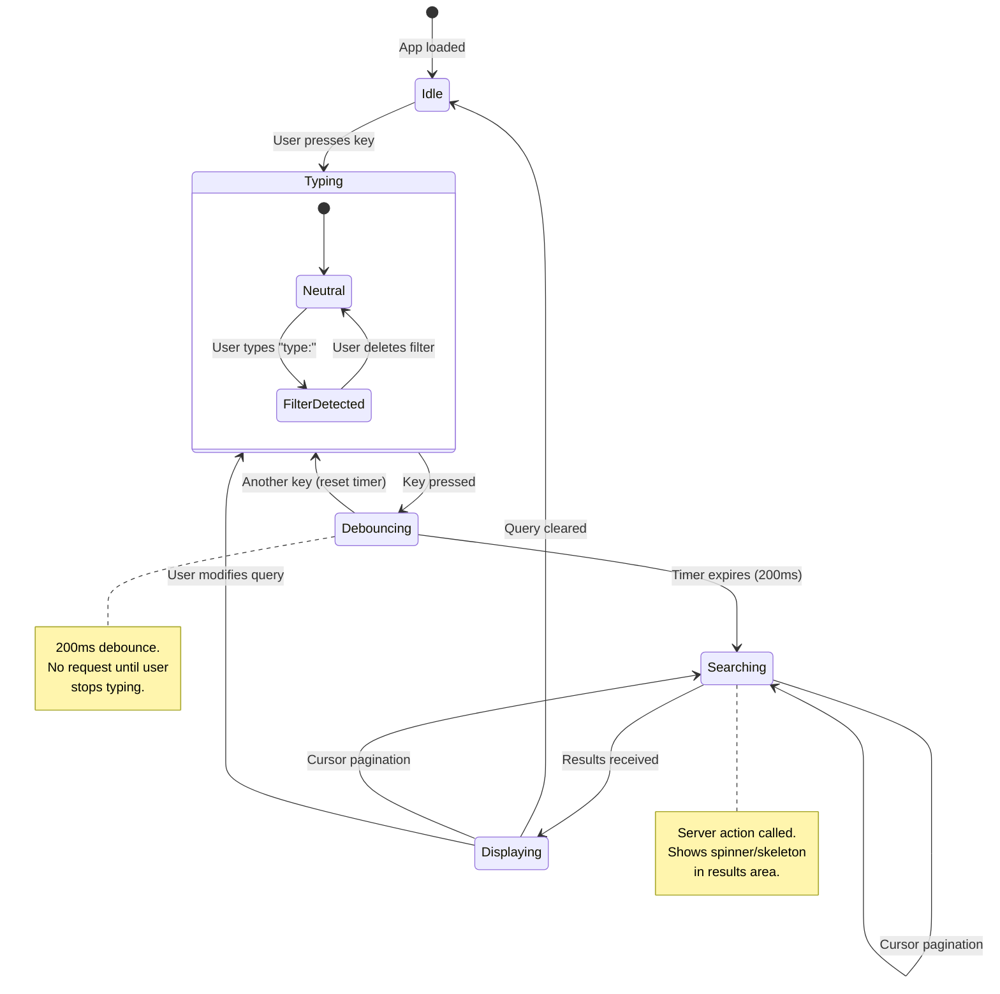

# RFC-002: Search Architecture

**Status:** Draft
**Author:** Devventory Architecture
**Date:** 2026-07-09
**Supersedes:** Implicit search patterns in `actions/search.ts`, `ResourceList` client-side filtering

---

## Table of Contents

1. [Objective](#objective)
2. [Search Principles](#search-principles)
3. [Search Sources](#search-sources)
4. [Query Types](#query-types)
5. [Search Pipeline](#search-pipeline)
6. [Tokenization & Normalization](#tokenization--normalization)
7. [Ranking](#ranking)
8. [Filters](#filters)
9. [Search Results](#search-results)
10. [State Machine](#state-machine)
11. [Keyboard Experience](#keyboard-experience)
12. [Empty States](#empty-states)
13. [Performance & Scalability](#performance--scalability)
14. [Search Boundaries](#search-boundaries)
15. [Current State Assessment](#current-state-assessment)
16. [Migration Path](#migration-path)
17. [Success Criteria](#success-criteria)

---

## Objective

Design the Search subsystem for Devventory — an independent engine that finds, ranks, filters, and returns Knowledge regardless of where it lives.

Search is not a feature. Search is a core capability. Every surface (web app, browser extension, mobile app, future public API) consumes the same engine.

This RFC defines:

- Which fields are searchable and why
- How queries are parsed, normalized, and matched
- How results are ranked and why
- How filters compose with search
- How future semantic search integrates without rewrites
- How the engine scales from 10 to 100,000 items

**Nothing beyond MVP is implemented. The architecture ensures nothing needs to be rewritten.**

---

## Search Principles

### Principle 1: Search answers intent, not keywords

Users remember context ("I saved a React article when building auth"), not filenames. The engine optimizes for human memory patterns, not filesystem conventions.

### Principle 2: Fast is a feature, not a metric

Every query returns results within the Doherty Threshold (400ms). The engine uses progressive enhancement: return exact matches instantly, compute fuzzy/ranking in the same request.

### Principle 3: Forgiving by default

Typing "reac" matches "React". "authenication" matches "authentication". The engine assumes typos, partial input, and imprecise memory. Exact match is the fastest path, not the only path.

### Principle 4: Context-aware

The same query returns different results depending on active filters, selected collection, and recent activity. Search knows where the user is and what they were doing.

### Principle 5: Predictable and explainable

Results are deterministic given the same query, same data, same user. Every result explains *why* it matched ("Matched in title", "Matched in notes"). No black boxes.

### Principle 6: Incremental by design

MVP implements exact + fuzzy search on indexed fields. Semantic search, natural language, and recommendations sit behind the same interface — they only replace the matching layer, never the pipeline.

---

## Search Sources

### Searchable Fields (MVP)

Every field is searchable by default unless marked otherwise.

| Field | Type | Indexed | Why searchable | Why not |
|-------|------|---------|----------------|---------|
| `title` | String | Yes | Primary identifier — what users remember most | — |
| `content`/`body` | Markdown | Yes | Full-text — the actual knowledge | — |
| `summary` | Markdown | Yes | AI-generated, may be absent — searched when present | — |
| `notes` | Markdown | Yes | User's personal annotation — critical for "why I saved this" | — |
| `url` | String | Yes | Exact + partial match for references | — |
| `domain` | String | Yes | "That thing from github.com" | — |
| `provider` | String | Yes | "The YouTube video about..." | — |
| `tags` | String[] | Via join | Lightweight categorization | — |
| `collection.name` | String | Via join | "The article in Frontend collection" | — |

### NOT Searchable (MVP)

| Field | Why not |
|-------|---------|
| `id` | Internal identifier, not user-facing |
| `userId` | Implicitly scoped, never searched |
| `createdAt` | Used for ordering/filtering, not search matching |
| `status` | Used for filtering, not search |
| `metadata` (JSON) | Schema-less provider data — too heterogeneous. Future: individual metadata fields may be indexed. |

### Future Searchable Fields

| Field | When | How |
|-------|------|-----|
| AI Embeddings | Semantic search MVP | Vector index (pgvector) |
| OCR text | Image/document processing | Extracted text stored in `content` or dedicated field |
| Transcripts | Video processing pipeline | Extracted text stored in `content` |
| Attachments (filenames) | Attachment indexing | `attachment.name` added to search scope |
| `collection.description` | When collections get descriptions | Same join pattern as name |

---

## Query Types

### MVP Query Types

| Type | Example | How it matches | Implementation |
|------|---------|----------------|----------------|
| **Exact** | `"Server Components"` | Substring match (case-insensitive) | SQL `ILIKE '%query%'` or `LIKE` with lowercasing |
| **Partial** | `Reac` | Prefix/substring match | Same as exact — naturally handles partial via substring matching |
| **Phrase** | `"React authentication flow"` | Whole-phrase substring | `ILIKE '%React authentication flow%'` across title + content |
| **Tag** | `#react` | Exact tag name match | Join through `KnowledgeTag` → `Tag.name` |
| **Collection** | `collection:frontend` | Collection name exact match | Join through `KnowledgeCollection` → `Collection.name` |
| **Provider** | `provider:github` | Provider field match | Direct field filter |
| **Domain** | `domain:react.dev` | Domain field match | Direct field filter |
| **Type** | `type:reference` | Type field match | Direct field filter |
| **Favorites** | `favorite:true` | Boolean field match | Direct field filter |

### Named Filter Syntax

Named filters (`collection:`, `provider:`, `domain:`, `type:`, `favorite:`) are parsed from the query string during tokenization. They are shorthand for the explicit filter API — internally they set the same filter parameters.

### Future Query Types

| Type | Example | When | How |
|------|---------|------|-----|
| **Natural Language** | `"Show me everything about React"` | Semantic MVP | Intent parsing → extract entities → semantic + keyword hybrid |
| **Fuzzy** | `authenication` → `authentication` | MVP+ | Levenshtein distance or trigram similarity on indexed fields |
| **Date Range** | `"last week"`, `"saved in March"` | MVP+ | Date parser → `createdAt`/`updatedAt` filter |
| **Boolean** | `react -redux` | Future | Exclusion operator in tokenizer |
| **Semantic** | `"authentication flow"` matches auth0 tutorial | Future | Vector similarity on embeddings |

### Query Type Detection

```
Raw query: "react #frontend type:reference domain:react.dev"
           ↓
Tokenizer parses:
  ┌─────────────────────────────┐
  │  textTokens: ["react"]       │
  │  tagFilter: "frontend"      │
  │  typeFilter: "reference"    │
  │  domainFilter: "react.dev"  │
  │  namedFilters: {            │
  │    type: "reference",       │
  │    domain: "react.dev"      │
  │  }                          │
  └─────────────────────────────┘
```

Named filters in the query string are extracted before text search. They compose with explicit filter parameters. If both specify the same filter, the query string value takes precedence (user intent is more specific).

---

## Search Pipeline

```
┌──────────┐
│  Query   │  Raw string from input
└────┬─────┘
     ↓
┌──────────┐
│ Normalize│  lowercase, trim, collapse whitespace
└────┬─────┘
     ↓
┌──────────┐
│ Tokenize │  extract text tokens, named filters, phrase tokens
└────┬─────┘
     ↓
┌──────────┐
│  Expand  │  optional: fuzzy expansions, synonym mapping (MVP: none)
└────┬─────┘
     ↓
┌──────────┐
│  Match   │  search all indexed fields for each token
└────┬─────┘
     ↓
┌──────────┐
│  Filter  │  apply explicit filters + named filters from query
└────┬─────┘
     ↓
┌──────────┐
│  Rank    │  score items, sort by score descending
└────┬─────┘
     ↓
┌──────────┐
│ Return   │  paginated results with match explanations
└──────────┘

Future:
  Match → Filter → [Semantic Rerank] → Rank → Return
```

### Pipeline Steps (Detailed)

#### 1. Normalize

```
Input:  "  ReAct #fRontend  "
Output: "react #frontend"

Operations:
  - trim whitespace
  - lowercase (preserves named filter structure but lowercases values)
  - collapse multiple spaces
  - if empty or <2 chars after normalize → return empty (no query)
```

#### 2. Tokenize

```
Input:  "react hooks #frontend type:reference domain:react.dev"

Tokens:
  text: ["react", "hooks"]
  namedFilters: { type: "reference", domain: "react.dev" }
  tagFilter: "frontend"
  phrase: null

Input:  '"server components" react'
Tokens:
  text: ["react"]
  phrase: "server components"
  namedFilters: {}
```

#### 3. Match (MVP)

```
For each text token:
  WHERE (
    title ILIKE '%token%' OR
    content ILIKE '%token%' OR
    summary ILIKE '%token%' OR
    notes ILIKE '%token%' OR
    url ILIKE '%token%' OR
    domain ILIKE '%token%' OR
    provider ILIKE '%token%'
  )
```

For phrase tokens, the ILIKE pattern uses the full phrase. For tags, join through `KnowledgeTag` with exact match.

```typescript
// MVP matching — single query, all fields
const results = await prisma.knowledgeItem.findMany({
  where: {
    userId,
    status: "active",
    OR: [
      { title: { contains: query, mode: "insensitive" } },
      { content: { contains: query, mode: "insensitive" } },
      { summary: { contains: query, mode: "insensitive" } },
      { notes: { contains: query, mode: "insensitive" } },
      { url: { contains: query, mode: "insensitive" } },
      { domain: { contains: query, mode: "insensitive" } },
      { provider: { contains: query, mode: "insensitive" } },
      { tags: { some: { tag: { name: { contains: query, mode: "insensitive" } } } } },
    ],
    // ...filters composed in
  },
  // ...
});
```

#### 4. Filter

Filters are AND-composed with the match results. The query builder starts with the match `WHERE` clause, then appends filter conditions.

```
WHERE (match_conditions)
  AND type = 'reference'
  AND domain = 'react.dev'
  AND favorite = true
  AND status = 'active'
  AND userId = '...'
```

#### 5. Rank

Results are scored client-side (MVP) or via SQL ordering (future). See [Ranking](#ranking) section.

#### 6. Return

Paginated results with `item`, `matchedFields: string[]`, and `score: number`.

---

## Tokenization & Normalization

### Tokenizer Behavior

| Input | Tokens | Named Filters | Tag Filter |
|-------|--------|---------------|------------|
| `react` | `["react"]` | — | — |
| `react hooks` | `["react", "hooks"]` | — | — |
| `"server components"` | `[]` (phrase) | — | — |
| `react #frontend` | `["react"]` | — | `"frontend"` |
| `type:reference react` | `["react"]` | `{type: "reference"}` | — |
| `domain:github.com react hooks` | `["react", "hooks"]` | `{domain: "github.com"}` | — |
| `collection:frontend #react provider:youtube` | `[]` | `{collection: "frontend", provider: "youtube"}` | `"react"` |

### Normalization Rules

1. All text is lowercased before matching (field values are lowercased at index time)
2. Multiple spaces collapse to single space
3. Leading/trailing whitespace removed
4. Empty query (after normalize) returns empty results — no "search all" mode
5. Single-character queries return empty results (too noisy)
6. Named filter values are lowercased but stored in original case for display

### Future: Token Expansion

```
Token: "authenication"
  ↓ (Levenshtein distance ≤ 2)
Expanded: ["authentication", "authenticated"]

Token: "react"
  ↓ (synonym map)
Expanded: ["react", "reactjs", "react.js", "react-native"]
```

Expansion is additive — the original token is always included.

---

## Ranking

### MVP Ranking Signals

Results are sorted by a composite score. Higher score = better match.

| Signal | Weight | Description | Implementation |
|--------|--------|-------------|----------------|
| **Exact Title Match** | 100 | Query appears as complete word in title | SQL: `CASE WHEN title ILIKE '% query %' THEN 100 ELSE 0 END` |
| **Title Prefix Match** | 80 | Query appears at start of title | `CASE WHEN title ILIKE 'query%' THEN 80 ELSE 0 END` |
| **Title Substring** | 60 | Query appears anywhere in title | `CASE WHEN title ILIKE '%query%' THEN 60 ELSE 0 END` |
| **Exact Tag Match** | 70 | Query matches a tag name exactly | Join match score |
| **Summary Match** | 50 | Query appears in summary | Per-field ILIKE |
| **Notes Match** | 45 | Query appears in user's notes | Per-field ILIKE |
| **Content Match** | 40 | Query appears in body content | Per-field ILIKE |
| **URL/Provider/Domain** | 30 | Query matches source metadata | Per-field ILIKE |
| **Recency Boost** | Dynamic | Items created/updated within 7 days get +10 | `createdAt > now() - 7d ? 10 : 0` |
| **Favorite Boost** | 15 | Favorited items rank higher | `favorite ? 15 : 0` |
| **Recently Opened** | 5 | Items opened in last 30 days | `lastOpenedAt > now() - 30d ? 5 : 0` |

### Score Computation (MVP)

```
For each result:
  score = max(signal_scores)  -- highest-scoring field wins
        + recency_boost
        + favorite_boost
        + recently_opened_boost

-- Example:
  Query "react" matches:
    - title: "React Authentication" → title_substring: 60
    - tag "react" exists → exact_tag: 70
    - created 2 days ago → recency: 10
    - favorited → favorite: 15
  Total: 70 + 10 + 15 = 95
```

### Why Max Instead of Sum

Summing scores across fields biases toward long documents (more places to match). Max ensures one strong match beats many weak matches. A React guide with "React" only in the title (60) should outrank a general article that mentions "React" once in content (40) and once in notes (45).

### Deterministic Tiebreaking

When two items have the same score:

1. More recently created
2. More recently opened
3. Alphabetical by title

Ranking is deterministic given identical query, data, and user.

### MVPs Ranking Implementation

Ranking is computed in application code after fetching results (Prisma does not support scoring functions natively). The query fetches matching items with all fields, scores them in TypeScript, then returns sorted results.

```typescript
// Pseudocode
function rank(items: KnowledgeItem[], query: string): ScoredItem[] {
  const q = query.toLowerCase();
  return items.map(item => {
    let score = 0;
    const matchedFields: string[] = [];

    if (item.title.toLowerCase().includes(` ${q} `)) {
      score = Math.max(score, 100);
      matchedFields.push("title");
    } else if (item.title.toLowerCase().startsWith(q)) {
      score = Math.max(score, 80);
      matchedFields.push("title");
    } else if (item.title.toLowerCase().includes(q)) {
      score = Math.max(score, 60);
      matchedFields.push("title");
    }

    if (item.summary?.toLowerCase().includes(q)) {
      score = Math.max(score, 50);
      matchedFields.push("summary");
    }
    // ... per-field checks
    if (item.favorite) score += 15;
    // ...

    return { item, score, matchedFields };
  }).sort((a, b) => b.score - a.score || b.item.createdAt - a.item.createdAt);
}
```

### Ranking for Multi-Token Queries

For queries with multiple tokens (e.g., "react hooks"):

1. Each token is scored independently
2. Items matching ALL tokens receive a **coverage bonus** (+20)
3. The final score is `max(token_scores) + coverage_bonus`
4. Items matching more tokens rank higher (all else equal)

### Future Ranking Signals

| Signal | Weight | When |
|--------|--------|------|
| **Semantic Similarity** | Varies | Semantic MVP — cosine similarity on embeddings |
| **Personal Usage Frequency** | +10 | Items opened ≥5 times get a boost |
| **Collection Match** | +25 | Query matches collection name containing the item |
| **Backlink Count** | +5 per link | Items referenced by others rank higher |
| **AI Relevance Score** | Varies | Future: ML-based relevance prediction |

---

## Filters

### Filter Types

| Filter | Type | Example | Default |
|--------|------|---------|---------|
| `type` | Enum | `reference`, `note`, `document`, `video`, `image`, `snippet`, `audio`, `email` | All |
| `provider` | String | `github`, `youtube`, `twitter` | All |
| `domain` | String | `react.dev`, `github.com` | All |
| `collection` | Collection ID | `clx...` | All |
| `tags` | String[] | `["react", "frontend"]` | All (AND within array) |
| `favorite` | Boolean | `true` | All |
| `status` | Enum | `active`, `archived`, `deleted` | `active` only |
| `dateFrom` | ISO date | `2026-01-01` | None |
| `dateTo` | ISO date | `2026-06-30` | None |

### Filter Composition Rules

```
1. All filters are AND-composed
2. Named filters in query string merge with explicit filters (query value wins on conflict)
3. Empty filter = no restriction
4. `status` defaults to `["active"]` — archived and deleted are opt-in
5. `tags` with multiple values: item must have ALL tags (AND semantics)
6. `collection` accepts collection ID, not name (names are not unique)
```

### Filter API (Future)

```typescript
interface SearchFilters {
  type?: KnowledgeType | KnowledgeType[];
  provider?: string | string[];
  domain?: string | string[];
  collectionId?: string;
  tags?: string[];       // AND
  favorite?: boolean;
  status?: "active" | "archived" | "deleted";
  dateFrom?: Date;
  dateTo?: Date;
}
```

Filters are passed as a separate parameter from the query string. Named filters in the query are parsed and merged into this object before execution.

### Filter Precedence

```
1. Explicit filters (from SearchFilters parameter)
2. Named filters (from query string)
   → Named filters override explicit filters for the same key
3. Default filters (status=active, userId scoped)
   → Cannot be overridden by user input
```

---

## Search Results

### Result Shape

```typescript
interface SearchResult {
  item: KnowledgeItem;
  score: number;
  matchedFields: string[];      // ["title", "notes"]
  matchedText?: string;         // excerpt showing the match (future)
}

interface SearchResponse {
  results: SearchResult[];
  total: number;
  hasMore: boolean;
  cursor: string | null;
  query: string;                // normalized query
  filters: SearchFilters;       // filters applied
  took: number;                 // ms
}
```

### Match Explanation

Every result explains why it matched. Displayed in the result item as subtle badges or text.

```
┌──────────────────────────────────────────────────┐
│ ● React Authentication Guide                     │
│   react.dev/guide/auth                           │
│   Matched in title · Matched in notes            │
│   3 days ago · reference                         │
└──────────────────────────────────────────────────┘
```

| Match Location | Badge |
|----------------|-------|
| title | "Matched in title" |
| content | "Matched in content" |
| summary | "Matched in summary" |
| notes | "Matched in notes" |
| tags | "Matched in tag" |
| collection | "Matched in collection" |
| url/domain | "Matched in source" |
| provider | "Matched in source" |

### Result Display

| Field | Display |
|-------|---------|
| Icon | Type-colored dot (DOT_COLORS) |
| Title | Item title (bold the matching portion — future) |
| Preview | First line of content/summary/notes (the one that matched) |
| Collection | Collection name breadcrumb, if any |
| Provider | Provider badge (if reference/video type) |
| Type | Type label |
| Last Updated | Relative time |
| Match Reason | Badge list |

---

## State Machine



### State Descriptions

| State | What happens | UI |
|-------|-------------|-----|
| **Idle** | No search active, user not interacting with search | Search input visible, normal content shown |
| **Typing** | User is actively typing | Show clear (X) button, no request yet |
| **Debouncing** | Timer counting down (200ms) | Same as Typing |
| **Searching** | Server action in flight | Loading indicator in results area, input remains responsive |
| **Displaying** | Results rendered | Results list with match explanations, pagination cursor |
| **FilterDetected** | Parser identified a named filter (`type:`, `collection:`, etc.) | Named filter highlighted in input |

### Transition Rules

1. Every keystroke during Debouncing resets the 200ms timer
2. Searching state does NOT block input — user can continue typing
3. New keystroke during Searching cancels the in-flight request (abort controller)
4. Empty query → return to Idle, do NOT send request
5. Same query as previous → use cached results (future), do NOT send request
6. Cursor pagination during Displaying → append results, do NOT clear existing

---

## Keyboard Experience

### Key bindings

| Key | Action | Context |
|-----|--------|---------|
| `Ctrl/Cmd + K` | Focus search input | Anywhere (global) |
| `Escape` | Blur search / clear query | Search focused |
| `ArrowDown` | Navigate to next result | Result list focused |
| `ArrowUp` | Navigate to previous result | Result list focused |
| `Enter` | Open selected result | Result selected |
| `Tab` | Move to next filter | Filter bar focused |
| `Shift + Tab` | Move to previous filter | Filter bar focused |

### Implementation Notes

- `Ctrl/Cmd + K` already exists in `CommandPalette` — search should integrate with or replace the existing command palette
- Arrow navigation wraps around (ArrowDown from last → first)
- Enter on a result opens it in the reader panel (same as clicking)
- Escape clears the query and returns to Idle (from empty query, Escape blurs the input)

---

## Empty States

### State Matrix

| State | Message | Action |
|-------|---------|--------|
| **No query** | — (search input idle, normal content shown) | — |
| **Searching** | Mini skeleton: 3 placeholder lines | None (transient) |
| **No results** | "No matches found for `{query}`" | "Try a different search" + suggestion: "Search in titles, notes, and content." |
| **No results (with filters)** | "No matches for `{query}` in this collection/tag/view" | "Try removing filters or broadening your search." |
| **No knowledge yet** | "Nothing saved yet." | "Capture your first link, note, or document." (same as current EmptyState) |
| **Error** | "Search failed. Try again." | Retry button |
| **Processing** | "Still indexing..." | Shown only if the search index is behind (future) |

### Design Rules

1. Never show a generic "No results" — always show what was searched
2. Suggestions should be actionable, not generic
3. Error states include a retry action
4. Empty state transitions are animated (fade) — never sudden

---

## Performance & Scalability

### Current Scale Requirements

| Scale | Items | Strategy |
|-------|-------|----------|
| S | <100 | Client-side filter is sufficient (current ResourceList behavior) |
| M | 100–1,000 | Server-side search with basic indexing (MVP) |
| L | 1,000–10,000 | Server-side search with full-text index (GIN/trigram) |
| XL | 10,000–100,000 | Dedicated search index (pgvector + trigram) |

### MVPs Strategy (handles M–L)

The MVP search engine runs on PostgreSQL with:

1. **ILIKE** for substring matching (handles up to ~1,000 items per user with acceptable perf)
2. **Trigram indexes** (`pg_trgm`) for fuzzy matching at L scale
3. **GIN indexes** on `title`, `content`, `summary`, `notes` for full-text search at L–XL scale
4. **B-tree indexes** on filter columns (`type`, `provider`, `domain`, `favorite`, `status`, `userId`)
5. **Join indexes** on `KnowledgeTag(tagId)`, `KnowledgeCollection(collectionId)`

### Index Strategy

```sql
-- MVP: Basic indexes (already in schema)
CREATE INDEX idx_knowledge_user_status ON "KnowledgeItem"(userId, status);
CREATE INDEX idx_knowledge_type ON "KnowledgeItem"(userId, type);

-- Scale L: Full-text search indexes
CREATE INDEX idx_knowledge_title_gin ON "KnowledgeItem" USING gin(to_tsvector('english', title));
CREATE INDEX idx_knowledge_content_gin ON "KnowledgeItem" USING gin(to_tsvector('english', content));

-- Scale L: Trigram indexes for fuzzy matching
CREATE EXTENSION IF NOT EXISTS pg_trgm;
CREATE INDEX idx_knowledge_title_trgm ON "KnowledgeItem" USING gin(title gin_trgm_ops);
CREATE INDEX idx_knowledge_content_trgm ON "KnowledgeItem" USING gin(content gin_trgm_ops);
```

### Caching Strategy

| Cache Layer | What | TTL | Invalidation |
|-------------|------|-----|--------------|
| **React Query / SWR** | Recent search results | Session | On mutation (capture, edit, delete) |
| **Server-side** | Top 50 results per popular query | 5 min | On any write to affected items |
| **Browser** | Recent query history | 100 entries | LRU eviction |

### Pagination Strategy

| Method | When | How |
|--------|------|-----|
| **Cursor-based** | Default | `cursor: id` + `take: 20` (current pattern) |
| **Offset-based** | Filter + sort views | `skip + take` (only for stable sort orders) |
| **Infinite scroll** | Result list | Trigger `loadMore` at scroll threshold |

Cursor-based pagination is the default. Offset-based is only used when the user explicitly sorts by a non-unique field (unlikely in MVP).

### Premature Optimization Warning

Do NOT add indexes or caches until profiling shows they're needed. The `ILIKE` approach with existing indexes handles up to 1,000 items per user with <200ms response time. Add trigram indexes at 1,000 items. Add full-text search at 10,000. Re-evaluate at every threshold.

---

## Search Boundaries

### Search is responsible for

| Responsibility | Description |
|---------------|-------------|
| **Finding** | Matching user queries against indexed fields |
| **Ranking** | Scoring and ordering results |
| **Filtering** | Composing type/provider/domain/tag/date/favorite filters |
| **Returning** | Paginated results with match explanations |
| **Indexing** | Building and maintaining search indexes |

### Search is NOT responsible for

| NOT responsible | Belongs to |
|----------------|------------|
| AI Generation | AI Pipeline |
| Capture | Capture Pipeline |
| Editing | Knowledge CRUD |
| Collections | Collection subsystem |
| Reader UI | Reader subsystem |
| Authentication | Auth subsystem |
| Recommendations | Future: Recommendation Engine |

### Subsystem Interaction

```
                    ┌──────────────┐
                    │  Knowledge   │
                    │   Entity     │
                    └──────┬───────┘
                           │ reads
                           ↓
┌─────────────────────────────────────────────┐
│              Search Engine                    │
│  ┌─────────┐  ┌────────┐  ┌──────────────┐  │
│  │ Indexer  │  │ Matcher │  │ Ranker       │  │
│  └────┬────┘  └────┬───┘  └──────┬───────┘  │
│       │            │             │           │
│  ┌────┴────┐  ┌────┴───┐  ┌──────┴───────┐  │
│  │ Index   │  │ Query  │  │ Score        │  │
│  │ Store   │  │ Parser │  │ Calculator   │  │
│  └─────────┘  └────────┘  └──────────────┘  │
└─────────────────────────────────────────────┘
         │           │            │
         ↓           ↓            ↓
    ┌────────┐ ┌──────────┐ ┌──────────┐
    │ Web    │ │ Browser  │ │ Mobile   │
    │ App    │ │ Extension │ │ App      │
    └────────┘ └──────────┘ └──────────┘

    All surfaces consume the same Search Engine.
    Search never calls AI, capture, or auth.
    Search reads Knowledge. Search never writes.
```

---

## Current State Assessment

### What Exists Today

| Component | File | Status |
|-----------|------|--------|
| `globalSearch` action | `actions/search.ts` | Orphaned — declared, never imported |
| `searchTags` action | `actions/tags.ts` | Active — used by TagInput |
| `ResourceList` filter | `components/resources/resource-list.tsx` | Client-side only — filters loaded items, no server query |
| `EmptyState` search display | `packages/shared/empty-state.tsx` | Active — search-aware empty states |
| `fetchMoreKnowledgeItems` | `actions/knowledge.ts` | Active — cursor-paginated, no search |
| `CommandPalette` (Ctrl+K) | `components/layout/command-palette.tsx` | Exists — search should integrate |

### What Must Change

| Change | Why | When |
|--------|-----|------|
| `globalSearch` → use ranked scoring | Current implementation is unranked `ORDER BY createdAt` | MVP |
| `ResourceList` → use server-side search | Client-side filter doesn't scale past 100 items | MVP |
| Named filter parsing in query | Required for `type:`, `collection:`, `provider:` syntax | MVP |
| Match explanation in results | Required for Principle 5 (explainable) | MVP |
| Debounce + abort controller | Required for Principle 2 (fast) | MVP |
| `CommandPalette` integration | Search should be the primary Cmd+K experience | MVP+ |

### What Stays

| Component | Why |
|-----------|-----|
| `searchTags` action | Works well for autocomplete — no change needed |
| `EmptyState` component | Already search-aware — extend props if needed |
| Cursor-based pagination | Already correct pattern — reuse |
| `fetchMoreKnowledgeItems` base query | Used for initial page load (no query) — search is separate |

---

## Migration Path

### Phase 1: Search Engine Core (MVP)

```
Files to create/modify:
  src/lib/search/engine.ts       — search(), rank(), filter()
  src/lib/search/tokenizer.ts    — parseQuery(), extractNamedFilters()
  src/lib/search/types.ts        — SearchQuery, SearchResult, SearchFilters
  src/actions/search.ts          — rewrite globalSearch to use engine
  src/components/search/         — search input, result list, match badges
```

**What works:**
- Exact + partial matching on all indexed fields
- Named filters in query string (`type:`, `domain:`, etc.)
- Composite ranking with match explanations
- Filter composition (explicit + named)
- 200ms debounce with abort controller
- Cursor-based pagination

**What does NOT work (deferred):**
- Fuzzy matching (trigram)
- Full-text search (GIN indexes)
- Semantic search

### Phase 2: Scale L (1,000–10,000 items)

```
Add pg_trgm extension
Create trigram indexes
Switch ILIKE → similarity() for fuzzy matching
```

### Phase 3: Scale XL (10,000–100,000 items)

```
Add GIN indexes for full-text search
Add tsvector column for precomputed text search
Add materialized view for common filter combinations
```

---

## Success Criteria

After reading this RFC, an engineer should be able to answer:

### How does search work?
A query is normalized, tokenized (text tokens + named filters extracted), matched against indexed fields via ILIKE, filtered by explicit + named filters, scored using a deterministic ranking algorithm, and returned with match explanations.

### Why are results ranked the way they are?
Each item gets a composite score: the highest single-field match (exact title = 100, title prefix = 80, title substring = 60, tag exact = 70, summary = 50, notes = 45, content = 40, source = 30) plus boosts for recency (+10), favorites (+15), and recently opened (+5). Ties broken by creation date, then last opened, then alphabetically.

### Which fields are searchable?
title, content, summary, notes, url, domain, provider, tags, and collection.name. All are indexed via ILIKE in MVP, with trigram and GIN indexes added at larger scales.

### How does filtering work?
Filters are AND-composed. Explicit filters (from SearchFilters parameter) merge with named filters parsed from the query string (query values win on conflict). Status defaults to "active" only. Tags filter uses AND semantics (item must have all specified tags).

### How does search scale over time?
- <100 items: client-side filter (current ResourceList) — no server call
- 100–1,000 items: server-side ILIKE with existing indexes
- 1,000–10,000 items: add trigram indexes (pg_trgm)
- 10,000–100,000 items: add GIN full-text indexes + tsvector
- >100,000 items: add pgvector for semantic search (no rewrite needed — pipeline is stable)

### What are search's boundaries?
Search finds, ranks, filters, and returns. It does NOT generate AI content, capture new items, edit existing items, manage collections, render reader UI, or authenticate users. It reads Knowledge and returns structured results.
