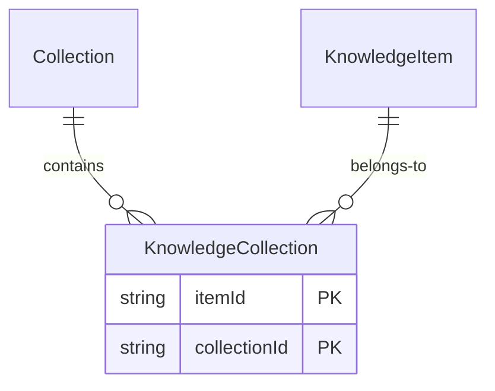
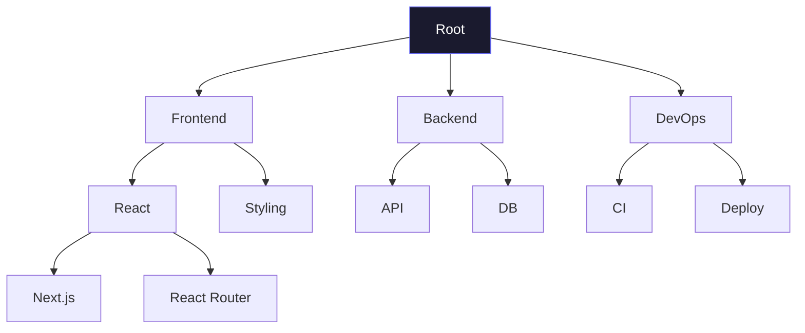
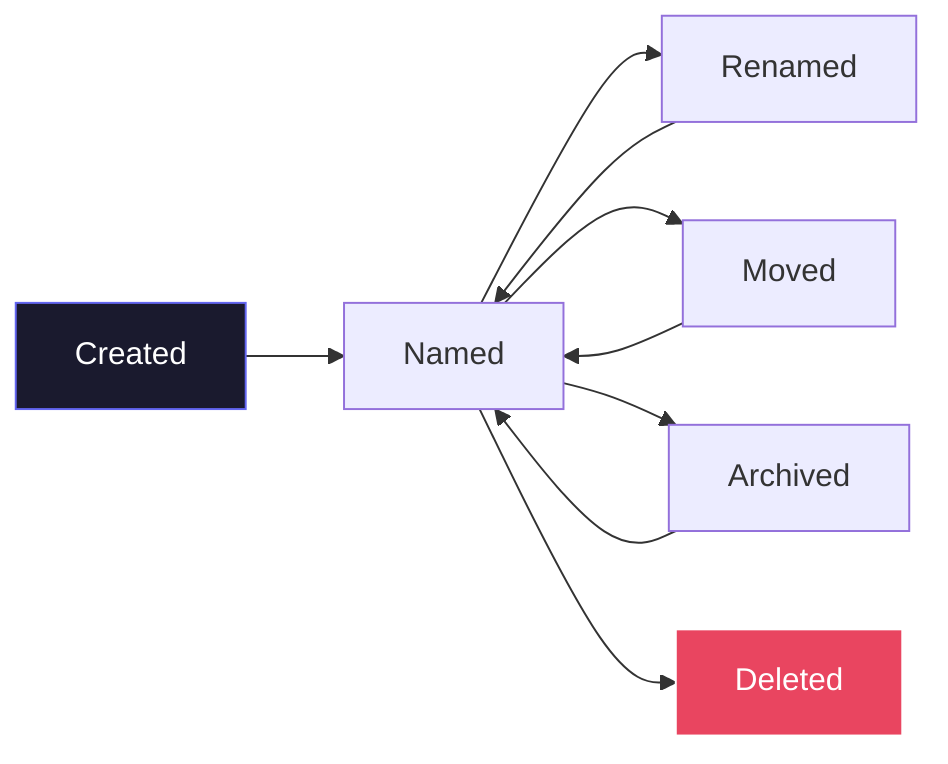
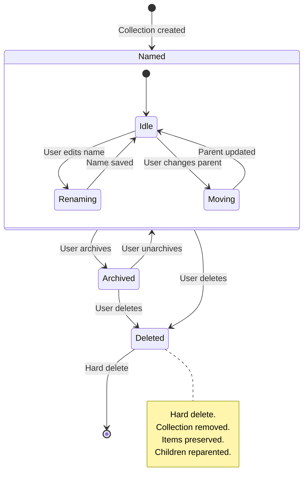

# RFC-003: Collections Architecture

**Status:** Draft
**Author:** Devventory Architecture
**Date:** 2026-07-09
**Supersedes:** Implicit collection patterns in `actions/collections.ts`, `sidebar.tsx` tree

---

## Table of Contents

1. [Objective](#objective)
2. [First Principles](#first-principles)
3. [What Collections Are](#what-collections-are)
4. [What Collections Are Not](#what-collections-are-not)
5. [Collection Domain Model](#collection-domain-model)
6. [System Collections](#system-collections)
7. [User Collections](#user-collections)
8. [Membership Rules](#membership-rules)
9. [Hierarchy](#hierarchy)
10. [Ordering](#ordering)
11. [Collection Lifecycle](#collection-lifecycle)
12. [State Machine](#state-machine)
13. [Search Integration](#search-integration)
14. [Capture Integration](#capture-integration)
15. [Browser Extension](#browser-extension)
16. [Mobile](#mobile)
17. [Responsibilities](#responsibilities)
18. [Current State Assessment](#current-state-assessment)
19. [Migration Path](#migration-path)
20. [Known Tradeoffs](#known-tradeoffs)
21. [Success Criteria](#success-criteria)

---

## Objective

Design the Collection subsystem — the way users organize Knowledge according to their own mental models.

This RFC defines:

- What Collections **are** (a many-to-many hierarchical organization primitive)
- What Collections **are not** (folders, tags, projects, search)
- How Collections **relate** to Knowledge (membership without duplication)
- How Collections **behave** across surfaces (web, extension, mobile, API)
- How Collections **integrate** with Search, Capture, and the Reader
- How future extensions **extend** the system without changing the core

**Nothing beyond the current implementation is built. The architecture ensures future work does not require rewrites.**

---

## First Principles

### Principle 1: Collections represent intent, not type

A Collection answers "Why did I save this here?" — not "What type is this?". Users organize by project, topic, context, or goal. The system supports every workflow without enforcing one.

### Principle 2: Collections are not folders

Folders enforce single-parent containment. Collections are many-to-many. An item belongs to multiple Collections simultaneously without duplication. The tree visualization is a UX convention, not a data constraint.

### Principle 3: Collections are separate from Tags

Tags are lightweight, flat, cross-user. Collections are hierarchical, user-owned, and intent-driven. Tags answer "What is this?" — Collections answer "Where does this belong to me?"

| Comparison | Tags | Collections |
|------------|------|-------------|
| Hierarchy | Flat | Nested (parent/child) |
| Cardinality | Many-to-many | Many-to-many |
| User scope | Shared names per user | Owned entirely by user |
| Purpose | Categorization | Organization by intent |
| Count | Dozens (typically) | Hundreds (potentially) |
| Ordering | Alphabetical | Manual (drag & drop) |

### Principle 4: Collections preserve Knowledge independence

A Knowledge Item exists independently of Collections. Adding it to a Collection does not move or duplicate data. Removing it from a Collection does not delete it. Deleting a Collection does not delete its items.

### Principle 5: Collections are symmetric

The relationship between Collection and Knowledge is bidirectional. A Collection knows its items. An item knows its Collections. Neither is the canonical owner. The join table is the source of truth.

---

## What Collections Are

A Collection is a user-owned, hierarchical, many-to-many grouping of Knowledge Items organized by intent.

### Examples

```
Student                          Founder
└── Semester 5                   ├── Ideas
    ├── Operating Systems        ├── Marketing
    │   ├── Notes                │   ├── Ads
    │   ├── Assignments          │   └── Content
    │   └── References           ├── Funding
    └── AI                       │   ├── Pitch Decks
        ├── Papers               │   └── Investors
        └── Labs                 └── Legal

Designer                         Reading Later
├── Inspiration                  ├── React
│   ├── UI                       ├── Design
│   ├── Motion                   ├── Backend
│   └── Color                    └── DevOps
├── Clients
│   ├── Active
│   └── Archive
└── Portfolio
```

### What makes a good Collection name

| Good | Why |
|------|-----|
| "Semester 5" | Context-rich, matches mental model |
| "Ideas" | Intent-driven, generic but specific to user |
| "Frontend" | Topic-based, clear membership criteria |
| "Reading Later" | Action-oriented, temporary by nature |

| Avoid | Why |
|-------|-----|
| "Links" | Describes type, not intent |
| "Uncategorized" | Admits failure to organize, becomes a dumping ground |
| "Stuff" | Too vague for retrieval |
| "Random" | Same as Stuff — impossible to re-find |

---

## What Collections Are Not

| Concept | It belongs to | Why Collections do NOT do it |
|---------|---------------|------------------------------|
| **Storage** | Knowledge Entity | Collections organize Knowledge, never store it |
| **Tagging** | Tags subsystem | Tags are flat, cross-cutting. Collections are hierarchical, intentional. |
| **Search** | Search subsystem | Search finds. Collections organize. |
| **Projects** | Future: Projects | Projects are Collections with deadlines, goals, and collaborators. Collections are permanent organization. |
| **Folders** | Filesystem metaphor | Folders imply single-parent containment. Collections are many-to-many. |
| **Categories** | E-commerce taxonomy | Categories are exclusive. Collections overlap. |
| **Labels** | Email paradigm | Labels apply to items. Collections contain items. Different directionality. |

---

## Collection Domain Model

```
┌─────────────────────────────────────┐
│             Collection               │
├─────────────────────────────────────┤
│  Identity (immutable)                │
│  ├── id: CollectionId               │
│  ├── userId: UserId (immutable)      │
│  └── createdAt: Timestamp            │
├─────────────────────────────────────┤
│  Properties (user-owned)             │
│  ├── name: String                    │
│  ├── description: String?            │
│  ├── icon: String? (emoji or icon)   │
│  ├── color: String? (accent)         │
│  └── sortOrder: Int                  │
├─────────────────────────────────────┤
│  Hierarchy                           │
│  ├── parentId: CollectionId?         │
│  └── children: Collection[]          │
├─────────────────────────────────────┤
│  Membership                          │
│  └── items: KnowledgeItem[]          │
│       (via KnowledgeCollection join) │
├─────────────────────────────────────┤
│  State (system-owned)                │
│  ├── kind: "user" | "system"        │
│  ├── isArchived: Boolean             │
│  ├── itemCount: Int (computed)       │
│  └── updatedAt: Timestamp            │
└─────────────────────────────────────┘
```

### Why each group exists

| Group | Why it exists |
|-------|---------------|
| **Identity** | Immutable anchor for URLs, API calls, and relationships |
| **Properties** | User customizes how the collection looks and feels |
| **Hierarchy** | Nesting enables parent/child navigation |
| **Membership** | Links to Knowledge Items through join table |
| **State** | System management — archive, visibility |

### Properties Detail

| Property | Type | Default | Purpose |
|----------|------|---------|---------|
| `id` | CollectionId | System | Immutable |
| `userId` | UserId | System | Owner |
| `createdAt` | Timestamp | System | Creation time |
| `name` | String | Required | Display name, editable |
| `description` | String? | null | Optional annotation |
| `icon` | String? | null | Emoji or custom icon |
| `color` | String? | null | Accent color for UI |
| `sortOrder` | Int | 0 | Manual ordering position |
| `parentId` | CollectionId? | null | Parent in hierarchy |
| `kind` | Enum | `"user"` | `"user"` or `"system"` |
| `isArchived` | Boolean | false | Soft-hidden |
| `itemCount` | Int | Computed | Denormalized count |
| `updatedAt` | Timestamp | System | Last modification |

### Why description, icon, color are first-class

These properties differentiate Collections in the sidebar. Users scan visually — icons and colors provide glanceable recognition. Descriptions provide tooltip context for deeply nested collections.

### Why `kind` is an enum

System Collections (Favorites, Recent, Archive, Trash) share the same model but have restricted behavior. `kind` prevents user deletion, name changes, or parent changes on system collections without schema-level enforcement.

---

## System Collections

### Definition

System Collections are built-in organizational views. They behave like Collections in the sidebar and filtered views but have restricted mutation rules.

```
┌──────────────────────────────────────────────────┐
│                  System Collections                │
├────────────┬───────────┬──────────┬──────────────┤
│  Favorites  │  Recent    │  Archive  │    Trash     │
│  (favorite) │ (temporal) │ (status)  │   (status)   │
└────────────┴───────────┴──────────┴──────────────┘
```

| Collection | Source | Purpose | Mutability |
|------------|--------|---------|------------|
| **Favorites** | `item.favorite = true` | Quick access to starred items | Read-only. Items added via favorite toggle, not drag-drop. |
| **Recent** | `item.createdAt` + `item.lastOpenedAt` | Recently captured or opened | Read-only. Computed from timestamps. |
| **Archive** | `item.status = "archived"` | Hidden items | Read-only. Items added/removed via archive action. |
| **Trash** | `item.status = "deleted"` | Recoverable deletions | Read-only. Items added via delete, removed via restore. |

### Rules for System Collections

1. System Collections are **read-only**. Users cannot rename, reorder, nest, or delete them.
2. System Collections are **not stored in the Collection table**. They are virtual views computed from Knowledge Item state.
3. System Collections **appear at the top** of the sidebar, above user collections. Order is fixed: Favorites, Recent, Archive, Trash.
4. System Collections are **always visible** in the sidebar, even when empty.
5. Items in Trash are **not counted** in user collection item counts.
6. Items in Archive are **excluded** from default views but **included** in search.

### Why virtual instead of stored

System Collections do not need join table entries. They are computed from existing Knowledge Item properties (`favorite`, `createdAt`, `lastOpenedAt`, `status`). This eliminates synchronization issues — an item always appears in Favorites when favorited, never needs explicit add/remove.

### Future (Not in MVP)

The `kind` field on Collection supports `"user"` and `"system"`. Future collection types (e.g., smart collections based on saved searches) can be added via the `kind` discriminator without schema changes.

---

## User Collections

### Creation Rules

- A Collection must have a non-empty name (1–100 characters)
- A Collection may be created at root level or as a child of another Collection
- A Collection may be created empty (zero items)
- A Collection's `sortOrder` is auto-assigned to the end of its parent's children

### CRUD Matrix

| Operation | Allowed? | Side effects |
|-----------|----------|--------------|
| **Create** | Yes | Adds to sidebar tree |
| **Read** | Yes | Returns tree with item count |
| **Rename** | Yes | Updates display name |
| **Reorder** | Yes | Updates sortOrder of siblings |
| **Move** | Yes | Changes parentId |
| **Archive** | Yes | Hides from default view, still searchable |
| **Delete** | Yes | Removes join records, items preserved |
| **Merge** | Future | Moves all items to target, deletes source |

### Deletion Rules

```
Delete Collection
  ↓
Remove all KnowledgeCollection join records
  ↓
Reparent children to deleted collection's parent
  ↓
Soft-delete? No — hard delete immediately

Rule: Deleting a Collection NEVER deletes Knowledge Items.
Rule: Deleting a parent Collection reparents children, does NOT cascade delete.
```

---

## Membership Rules

### The Join Table



### Cardinality

| Relationship | Cardinality | Direction |
|-------------|-------------|-----------|
| Collection : KnowledgeItem | Many-to-many | Bidirectional |
| Collection : Collection (parent/child) | One-to-many | Unidirectional (parent → child) |

### Membership Invariants

1. A Knowledge Item may belong to **zero or more** Collections
2. A Collection may contain **zero or more** Knowledge Items
3. Adding an item to a Collection **never duplicates** the item
4. Removing an item from a Collection **never deletes** the item
5. The same item may appear in **multiple** Collections simultaneously
6. An item in a parent Collection is **not** implicitly in child Collections (no inheritance)
7. An item in a child Collection is **not** implicitly in parent Collections (no bubbling)

### Why no inheritance

If parent "Frontend" contains item A and child "React" contains item B:
- item A is NOT visible in "React"
- item B is NOT visible in "Frontend"

Inheritance would violate the rule that Collections represent explicit user intent. If the user wants item B in "Frontend", they add it explicitly. Inheritance would create invisible membership that surprises users when they delete "React" and lose access to item B.

### Membership Lifecycle

```
Item created            → belongs to 0 collections
Item added to collection → KnowledgeCollection created
Item removed             → KnowledgeCollection deleted
Collection deleted       → all KnowledgeCollection records for that collection deleted
Item deleted             → all KnowledgeCollection records for that item deleted
```

### Current Gap

The `capture-pipeline.ts` accepts `collectionIds` but never writes them to the join table. This is fixed in the [Migration Path](#migration-path).

---

## Hierarchy



### Hierarchy Rules

1. Maximum nesting depth: **5 levels** (root → level 5). Beyond that, navigation becomes impractical.
2. A Collection cannot be its own ancestor (cycle detection enforced at write time).
3. A Collection cannot be moved into its own descendant.
4. Moving a parent moves all descendants with it (preserves relative structure).
5. Deleting a parent reparents children to the parent's parent (does not cascade).

### Flat Storage, Tree Display

Collections are stored flat in the database (each has a `parentId`). The tree is constructed at read time by `getCollectionTree()` — the same approach used today. This enables:

- Efficient subtree queries (`WHERE parentId = ?`)
- Simple re-parenting (update `parentId`)
- No recursive CTEs needed for shallow trees (<5 levels)
- Tree is rebuilt on every render — no stale cache issues

### Depth Limit Rationale

| Depth | Use case | Feasibility |
|-------|----------|-------------|
| 1 | Root level | All users |
| 2 | Topic / Subtopic | Common |
| 3 | Semester / Course / Topic | Common |
| 4 | Project / Phase / Component / Task | Occasional |
| 5 | Deep taxonomy | Rare, but supported |
| 6+ | Excessive | UI collapses, navigation suffers |

---

## Ordering

### Manual Ordering (Default)

Users drag and drop to reorder. `sortOrder` is an integer updated on every drop. Siblings are re-indexed on drop to maintain gapless sequence.

```
Before:
  Frontend (sortOrder: 0)
  Backend  (sortOrder: 1)
  DevOps   (sortOrder: 2)

User drags DevOps above Frontend:
  DevOps   (sortOrder: 0)
  Frontend (sortOrder: 1)
  Backend  (sortOrder: 2)
```

### Alternative Ordering Modes

| Mode | How it works | Tradeoff |
|------|-------------|----------|
| **Manual** | Drag & drop reorder | Requires user effort, best for small sets |
| **Alphabetical** | Auto-sorted A-Z | No manual control, predictable |
| **Recently updated** | By `updatedAt` descending | Highlights active collections, shuffles often |
| **Item count** | By `itemCount` descending | Useful for finding fullest collections |

### Current Implementation

The existing `sortOrder` field supports manual ordering. Alphabetical and other modes can be added as client-side sort options without schema changes.

---

## Collection Lifecycle



### States

| State | Meaning | Visibility |
|-------|---------|------------|
| **Created** | Collection record exists, no name assigned (transient) | Not visible to user |
| **Named** | Active, visible in sidebar | Fully visible |
| **Renamed** | Name changed, no other state change | Same as Named |
| **Moved** | Parent changed, no other state change | Same as Named |
| **Archived** | Hidden but not deleted | Hidden from default view, searchable |
| **Deleted** | Removed from database | Gone |

### Transitions

| From | To | Trigger | Notes |
|------|----|---------|-------|
| Created | Named | User provides name | Transient state — skipped if name provided at create |
| Named | Renamed | User edits name | No limit on rename count |
| Named | Moved | User changes parent | Children move with parent |
| Named | Archived | User archives | Reversible |
| Archived | Named | User unarchives | Items restored to view |
| Named | Deleted | User deletes | Children reparented, items preserved |
| Archived | Deleted | User deletes | Same as Named delete |

### Invalid Transitions

| From | To | Why |
|------|----|-----|
| Created | Deleted | Cannot delete what doesn't exist |
| Named | Created | Cannot go back to unnamed |
| Archived | Deleted (cascade) | Deletion only removes the Collection, not items |

---

## State Machine



---

## Search Integration

### Named Filter: `collection:`

```
Query: "react collection:frontend"

Parses as:
  text: "react"
  namedFilters: { collection: "frontend" }

Executes as:
  WHERE matches_react
    AND item.id IN (
      SELECT kc."itemId"
      FROM "KnowledgeCollection" kc
      JOIN "Collection" c ON c.id = kc."collectionId"
      WHERE c.name ILIKE 'frontend'
        AND c."userId" = ?
    )
```

### Rules

1. `collection:` matches by **name** (case-insensitive), not ID. Names are unique per user (enforced by `@@unique([name, userId])` in the current schema).
2. Phrase syntax supported: `collection:"Operating Systems"` — matches multi-word names.
3. `collection:` composes with other filters (AND).
4. `collection:` without a query text returns ALL items in that collection (filter-only mode).

### Search Result Display

When an item matches because it belongs to the filter collection, the result shows:

```
Matched in collection "Frontend"
```

### Sidebar Integration

Clicking a Collection in the sidebar sets `?collection=<id>` in the URL. This applies a collection filter to the workspace. The filter is displayed as a removable badge (same pattern as tag and favorites filters).

---

## Capture Integration

### Current Gap

`capture-pipeline.ts` accepts `collectionIds[]` but never writes them. The join records are never created.

### Required Change

After `enrichCapture` completes and the KnowledgeItem is created:

```
1. Validate collectionIds belong to the user
2. For each collectionId:
     INSERT INTO "KnowledgeCollection" (itemId, collectionId)
3. Error handling: partial failures log but do not fail the capture
```

### Capture Flow with Collections

```
User captures URL
  ↓
Select collection (optional):
  - Recent collections (last 5 used)
  - Suggested collection (AI-detected topic match — future)
  - New collection (inline create)
  - None (capture without collection)
  ↓
Create KnowledgeItem
  ↓
Create KnowledgeCollection records
  ↓
Return success
```

### Extension Capture Flow

The browser extension sends `collectionIds` in the capture payload. The API validates ownership and creates join records. The extension does not need Collection logic — it sends what the user selected and the API handles the rest.

---

## Browser Extension

### Requirements

When capturing, the user may optionally select a Collection:

1. **Recent collections** — last 5 collections the user added items to. Stored in extension local state, synced on capture.
2. **Suggested collection** — the server suggests a collection based on the captured URL's domain/topic (future).
3. **New collection** — inline text input, creates a new root-level collection.
4. **None** — capture without collection assignment.

### Architecture

The extension does NOT:

- Fetch the full collection tree
- Replicate collection CRUD logic
- Manage collection hierarchy
- Cache collection state

Instead, the extension sends:

```json
{
  "url": "https://...",
  "collectionIds": ["col_1", "col_2"],
  "createCollections": ["New Collection Name"]
}
```

The API:
1. Validates `collectionIds` ownership
2. Creates collections from `createCollections` (root level, end of sort order)
3. Creates `KnowledgeCollection` join records for all resolved IDs
4. Returns the created Knowledge Item with assigned collections

### Why extension-side logic is minimal

The extension is a thin client. Collection management lives on the server. The extension proposes (recent, suggested, new) — the server resolves (validates, creates, joins). This keeps the extension lightweight and avoids sync issues.

---

## Mobile

### Parity Requirements

Collections behave identically on mobile. Only the interaction differs:

| Interaction | Desktop | Mobile |
|-------------|---------|--------|
| Browse tree | Sidebar (always visible) | Drawer (slide-in) |
| Create | Right-click → New, or + button | Bottom sheet → New |
| Rename | Inline click on name | Tap → modal text input |
| Reorder | Drag & drop | Long press → drag handle |
| Add item to collection | Drag item onto collection, or context menu → Add to | Share sheet → Select collection |
| System collections | Top of sidebar | Top of drawer |

### No Mobile-specific Architecture

Collections do not need a separate mobile model. The same API (`getCollectionTree`, `createCollection`, `renameCollection`, `deleteCollection`, `addItemToCollection`, `removeItemFromCollection`) serves all surfaces. The mobile client renders the tree differently but consumes the same data.

---

## Responsibilities

### Collections are responsible for

| Responsibility | Description |
|---------------|-------------|
| **Organization** | Grouping Knowledge Items by user intent |
| **Hierarchy** | Parent/child nesting with depth limit |
| **Membership** | Many-to-many join records between Collection and KnowledgeItem |
| **Navigation** | Tree rendering, expand/collapse, sidebar display |
| **Filtering** | `?collection=` URL param, workspace filtering |
| **Search integration** | `collection:` named filter in search queries |

### Collections are NOT responsible for

| NOT responsible | Belongs to |
|----------------|------------|
| **Storage** | Knowledge Entity — Collections never store content |
| **Knowledge lifecycle** | Knowledge State Machine — status, processing, enrichment |
| **Search indexing** | Search Engine — Collections provide join data, search builds indexes |
| **Capture** | Capture Pipeline — Collection assignment is a side effect of capture |
| **AI enrichment** | AI Pipeline — Collections have no AI-generated properties |
| **Reader display** | Reader subsystem — Collections do not affect how items are displayed |
| **Authentication** | Auth subsystem — user identity is pre-established |

### Subsystem Interaction Diagram

```
                    ┌──────────────┐
                    │  Knowledge   │
                    │   Entity     │
                    └──────┬───────┘
                           │
                    ┌──────┴───────┐
                    │  Collection   │
                    │  Subsystem    │
                    ├───────────────┤
                    │  CRUD         │
                    │  Tree         │
                    │  Membership   │
                    └──┬───┬───┬───┘
                       │   │   │
              ┌────────┘   │   └────────┐
              ↓            ↓            ↓
         ┌────────┐ ┌──────────┐ ┌──────────┐
         │ Search │ │ Capture  │ │   API    │
         │ Engine │ │ Pipeline │ │ (Public) │
         └────────┘ └──────────┘ └──────────┘

    Collection never calls AI, Reader, or Auth.
    Collection exposes tree + membership.
    Search queries membership for collection: filters.
    Capture writes membership after item creation.
    API serves all CRUD to Web, Extension, and Mobile.
```

---

## Current State Assessment

### What Exists Today

| Component | File | Status |
|-----------|------|--------|
| `Collection` model | `prisma/schema.prisma:125` | Complete — id, name, parentId, sortOrder, userId, timestamps |
| `KnowledgeCollection` join table | `prisma/schema.prisma:141` | Complete — composite PK on itemId + collectionId |
| `getCollectionTree()` | `actions/collections.ts:16` | Complete — fetches flat, builds nested tree |
| `createCollection()` | `actions/collections.ts:49` | Complete — auto sortOrder |
| `renameCollection()` | `actions/collections.ts:69` | Complete |
| `deleteCollection()` | `actions/collections.ts:81` | Complete — hard delete, no reparent |
| `addItemToCollection()` | `actions/collections.ts:93` | Complete |
| `removeItemFromCollection()` | `actions/collections.ts:105` | Complete |
| `CollectionTree` sidebar component | `sidebar.tsx:56` | Complete — renders tree from server action |
| `CollectionItem` component | `sidebar.tsx:26` | Complete — recursive, expand/collapse |

### What Exists But Has Gaps

| Component | Gap | Severity |
|-----------|-----|----------|
| `capture-pipeline.ts` | Accepts `collectionIds` but never writes them | High — Collection assignment during capture is broken |
| `POST /api/capture` | Passes `collectionIds` to pipeline but pipeline ignores them | High |
| `deleteCollection()` | No child reparenting — deletion orphans children | Medium — children are deleted via cascade in schema (line 134: `onDelete: Cascade`) |

### What Does NOT Exist

| Feature | Priority | Notes |
|---------|----------|-------|
| Collection filter in workspace (`?collection=` URL param) | High | Sidebar collections have no click handler |
| Collection display in ResourceItem | Medium | Items don't show which collections they belong to |
| Collection selector during capture | High | No UI to choose collection when capturing |
| System Collections (Favorites, Recent, Archive, Trash) | Medium | Currently exposed as nav items in sidebar, not as virtual collections |
| Collection reordering (drag & drop) | Medium | `sortOrder` exists but no UI to change it |
| Collection inline rename in sidebar | Medium | Must go to settings — should be inline |
| Collection context menu (right-click) | Low | Create, rename, delete, archive |
| Collection description, icon, color | Low | Model supports it, no UI yet |

### Schema Cascade Bug

Current schema at line 134:
```prisma
parent   Collection?  @relation("CollectionHierarchy", fields: [parentId], references: [id], onDelete: Cascade)
```

`onDelete: Cascade` means deleting a parent Collection deletes all children. This violates the rule "deleting a parent reparents children." The cascade should be `SetNull` or the delete action should reassign parentIds before deletion.

---

## Migration Path

### Phase 1: Fix Existing Gaps (Immediate)

```
1. Fix capture pipeline to write collectionIds:
   src/lib/capture-pipeline.ts — after KnowledgeItem created, loop collectionIds and create KnowledgeCollection records

2. Fix schema cascade:
   prisma/schema.prisma — change onDelete: Cascade to onDelete: SetNull on Collection.parent
   actions/collections.ts — deleteCollection() should reparent children before deleting

3. Wire collection click in sidebar:
   sidebar.tsx — CollectionItem sets ?collection=<id> URL param
   knowledge-workspace.tsx — read ?collection= URL param, pass to ResourceList

4. Add collection filter display:
   ResourceList — show active collection filter badge, clearable
```

### Phase 2: Collection UX (Next)

```
5. Add collection selector during capture (web + extension)
6. Add inline rename on CollectionItem in sidebar
7. Add collection context menu (right-click: rename, delete, create child)
8. Show collection badges on ResourceItem
9. Add drag & drop reorder in sidebar
```

### Phase 3: System Collections (Next+)

```
10. Implement virtual system collections (Favorites, Recent, Archive, Trash)
11. Add system collection section at top of sidebar
12. Wire system collection clicks to ?filter= param
```

---

## Known Tradeoffs

### Tradeoff 1: Flat storage + tree construction vs. recursive storage

**Chosen:** Flat storage (each Collection has `parentId`), tree built at read time by `getCollectionTree()`.

**Why:** Shallow trees (<5 levels) make recursive queries unnecessary. Flat storage enables simple re-parenting (update one column). Tree construction is O(n) where n = total collections (typically <500). The tradeoff is acceptable for single-user collections.

**When to reconsider:** If collections exceed 1,000 per user or nesting exceeds 10 levels, consider materialized path (ancestors array) or nested sets.

### Tradeoff 2: Manual ordering vs. automatic ordering

**Chosen:** Manual ordering (sortOrder) by default, with alphabetical and other modes as client-side options.

**Why:** Collections represent intent. Users want to control the order their collections appear. Alphabetical ordering pushes related collections apart (e.g., "React" and "Vue" are separated by unrelated names starting with letters in between).

**Downside:** Requires user effort to maintain. New collections appear at the end by default, and users must drag them into place.

### Tradeoff 3: No collection inheritance vs. implicit membership

**Chosen:** No inheritance. Items in child collections are not implicitly in parent collections.

**Why:** Users would be confused if deleting a parent collection "lost" items that were in child collections. Explicit membership matches the mental model of "I put this here."

**Downside:** Users may expect folder-like behavior where browsing "Frontend" shows all "Frontend/React" items. A future "Show all descendant items" toggle can address this without changing the core membership model.

### Tradeoff 4: Hard delete vs. soft delete for Collections

**Chosen:** Hard delete. Collection removal is immediate and permanent.

**Why:** Collections are organizational structures, not Knowledge Items. Undeleting a Collection is rare — if a user wants it back, they recreate it. The items are preserved regardless. Soft delete adds complexity (visibility filters, cleanup jobs) with minimal benefit.

**Exception:** If future usage data shows frequent accidental collection deletion, soft delete can be added without schema changes (add `deletedAt` column, filter in `getCollectionTree()`).

### Tradeoff 5: Tree sidebar vs. flat list

**Chosen:** Tree sidebar (current implementation) with expand/collapse.

**Why:** Tree navigation is familiar, supports hierarchy, and conserves vertical space. Flat lists with breadcrumbs are an alternative for mobile.

**Downside:** Deeply nested collections require multiple clicks to reach. The 5-level depth limit mitigates this.

---

## Success Criteria

After reading this RFC, an engineer should be able to answer:

### Why do Collections exist?
Collections exist to organize Knowledge Items by user intent. They answer "Why did I save this here?" rather than "What type is this?".

### How do Collections differ from Tags?
Tags are flat, lightweight, cross-cutting categorizations that answer "What is this?". Collections are hierarchical, user-owned, intent-driven organizations that answer "Where does this belong to me?". Tags are for finding. Collections are for browsing.

### How do Collections differ from Search?
Search finds items when the user has a specific query in mind. Collections enable browsing when the user has a context in mind ("Let me check my Frontend collection"). They are complementary — search operates across all items, collections scope search within a context.

### Why are Collections many-to-many?
Because Knowledge is multi-contextual. A React article belongs in "Frontend" for a web developer, but also in "Inspiration" for a designer. Single-parent containment (folders) forces a choice. Many-to-many allows items to exist in multiple contexts without duplication.

### How does hierarchy work?
Collections are stored flat with `parentId` references. The tree is constructed at read time. Maximum depth is 5 levels. Deleting a parent reparents children to the grandparent. Items in child collections are not implicitly in parent collections.

### How does membership work?
Through a join table (`KnowledgeCollection`). Adding an item to a collection creates a join record. Removing it deletes the join record. Deleting a collection deletes all join records but NOT the items. Items can belong to zero or more collections.

### What are the system collections?
Favorites, Recent, Archive, and Trash are virtual collections computed from Knowledge Item properties. They appear at the top of the sidebar, are read-only, and require no join table entries. They are always visible even when empty.
