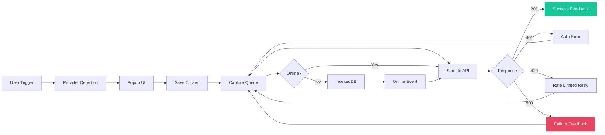
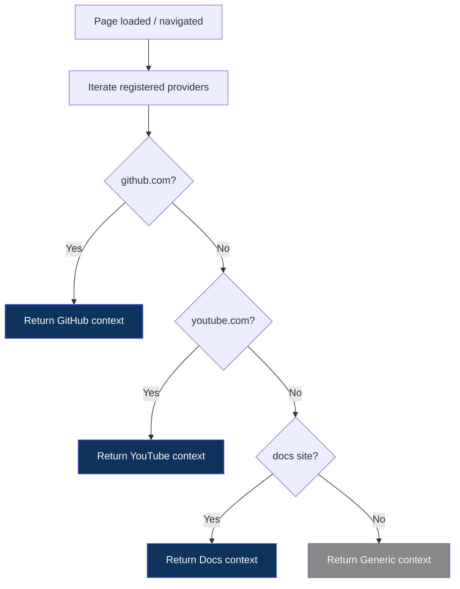
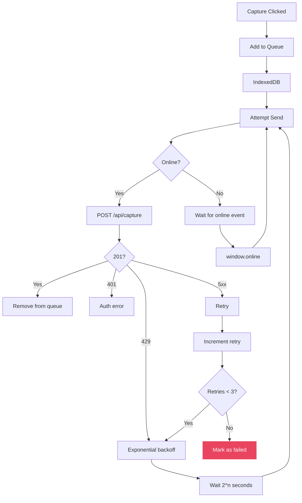

# RFC-004: Browser Extension Architecture

**Status:** Draft
**Author:** Devventory Architecture
**Date:** 2026-07-09
**Supersedes:** Implicit patterns in `apps/extension/entrypoints/`, `apps/extension/providers/`, `apps/extension/context-engine/`

---

## Table of Contents

1. [Objective](#objective)
2. [First Principles](#first-principles)
3. [Architecture Overview](#architecture-overview)
4. [Extension Modules](#extension-modules)
5. [Capture Lifecycle](#capture-lifecycle)
6. [Provider Registry](#provider-registry)
7. [Capture Entry Points](#capture-entry-points)
8. [Floating Capture Button](#floating-capture-button)
9. [Toolbar Popup](#toolbar-popup)
10. [Context Menu](#context-menu)
11. [Universal Capture Request](#universal-capture-request)
12. [Authentication](#authentication)
13. [Offline Support](#offline-support)
14. [Error Handling](#error-handling)
15. [Performance](#performance)
16. [Security](#security)
17. [Browser Compatibility](#browser-compatibility)
18. [Current State Assessment](#current-state-assessment)
19. [Migration Path](#migration-path)
20. [Known Tradeoffs](#known-tradeoffs)
21. [Success Criteria](#success-criteria)

---

## Objective

Design the Browser Extension — Devventory's primary capture surface and one of its defining products.

This RFC defines:

- How the extension works as a **thin capture client** (no business logic, no dashboard)
- How capture flows from user action to saved Knowledge
- How providers integrate through a **Provider Registry**
- How the extension authenticates without browser cookies
- How failures are handled (offline, network, auth, timeout)
- How the extension stays lightweight, secure, and modular

**The extension already exists. This RFC defines what needs to change to make it production-ready.**

---

## First Principles

### Principle 1: The extension captures. The backend understands. The web app presents.

The extension never:
- Duplicates backend logic (processing, enrichment, categorization)
- Renders a dashboard or knowledge views
- Manages collections, tags, or settings
- Stores knowledge data beyond transient capture state

### Principle 2: Capture must take fewer than five seconds

From the moment the user decides to save, the capture request must be sent within five seconds. The extension optimizes for frictionless input. AI enrichment, duplicate detection, and context fetching are async — they happen on the server after the 201 response.

### Principle 3: The extension disappears

Users should never think "I should open Devventory." The extension exists passively — a toolbar icon, a right-click menu, a floating button on text selection. It activates only when the user has found something worth remembering.

### Principle 4: Every entry point produces the same request

The toolbar icon, right-click menu, floating selection button, and keyboard shortcut all produce the same `CapturePayload` structure. The entry point is metadata on the request, not a different code path.

### Principle 5: Providers are a registry, not a switch statement

Every website integration implements the same `Provider` interface. Adding a new provider means registering a new module — no changes to existing code. The registry iterates all providers and the first match wins.

---

## Architecture Overview

```
┌─────────────────────────────────────────────────────────┐
│                    Browser Extension                       │
│                                                           │
│  ┌────────────┐  ┌──────────────┐  ┌──────────────────┐  │
│  │  Content    │  │  Background  │  │  Provider         │  │
│  │  Script     │  │  Worker      │  │  Registry         │  │
│  │             │  │              │  │                  │  │
│  │  Selection  │  │  Auth (key)  │  │  GitHub          │  │
│  │  detection  │  │  API calls   │  │  YouTube         │  │
│  │  Popup UI   │  │  Queue mgmt  │  │  Docs            │  │
│  │  Provider   │  │  Retry       │  │  Generic         │  │
│  │  detection  │  │              │  │  ...             │  │
│  └──────┬──────┘  └──────┬───────┘  └──────────────────┘  │
│         │                │                                 │
│         └───────┬────────┘                                 │
│                 ↓                                          │
│         ┌───────────────┐                                  │
│         │  Capture       │                                  │
│         │  Queue         │                                  │
│         │  (IndexedDB)   │                                  │
│         └───────┬───────┘                                  │
└─────────────────┼──────────────────────────────────────────┘
                  ↓  HTTPS
         ┌────────────────┐
         │  Capture API   │  POST /api/capture
         │  (Server)      │
         └───────┬────────┘
                  ↓
         ┌────────────────┐
         │  Knowledge     │
         │  Pipeline      │
         └────────────────┘
```

### Why a queue between content script and API

The queue handles:
- Offline captures (store locally, retry when online)
- Rate limiting (batch or delay requests)
- Ordering (captures sent in the order they were created)
- Failure recovery (retry with exponential backoff)

The queue lives in the background worker (persistent) backed by IndexedDB (survives worker restarts).

### Why content script and background are separate

The content script has access to the page DOM (selection, metadata, provider detection). The background worker has access to storage, fetch, and tabs API. They communicate via `chrome.runtime.sendMessage`. No DOM access in background, no fetch access in content script (via MV3 CSP). Separation is enforced by the browser.

---

## Extension Modules

```
extension/
├── entrypoints/
│   ├── background.ts      → Background service worker
│   ├── content.ts         → Content script (injected into pages)
│   └── options/            → Settings page (future)
├── providers/
│   ├── registry.ts         → Provider registration + detection
│   ├── github.ts           → GitHub provider
│   ├── youtube.ts          → YouTube provider
│   ├── docs.ts             → Documentation site provider
│   └── generic.ts          → Fallback provider (every other site)
├── capture-engine/
│   ├── queue.ts            → IndexedDB capture queue
│   ├── sender.ts           → API request builder + retry
│   └── types.ts            → CapturePayload, QueueItem, etc.
├── context-engine/
│   ├── index.ts            → Provider detection orchestrator
│   ├── types.ts            → Provider, Context, Action interfaces
│   ├── popup.ts            → Inline popup UI builder
│   ├── ui.ts               → Base styles + DOM utilities
│   └── metadata.ts         → Page metadata extraction (title, description, OG tags)
├── auth/
│   └── index.ts            → API key management + verification
├── lib/
│   └── types.ts            → Shared types (CapturePayload, etc.)
└── assets/
    ├── icon-16.png
    ├── icon-48.png
    └── icon-128.png
```

### Module Responsibilities

| Module | Responsibility | Never |
|--------|---------------|-------|
| **Content script** | DOM interaction, selection detection, popup rendering, provider detection | Makes network requests, accesses storage |
| **Background worker** | Auth, API calls, queue, retry, extension lifecycle | Accesses page DOM |
| **Capture engine** | Queue management, request building, retry logic, offline storage | Renders UI, detects providers |
| **Context engine** | Provider detection orchestration, popup UI, metadata extraction | Makes API calls, stores data |
| **Providers** | Site-specific detection, context extraction, chip injection | Handle auth, queue, or capture |
| **Auth** | API key storage, verification, rotation | Manage capture logic |
| **Assets** | Icons, static resources | None |

---

## Capture Lifecycle



### Phase Details

#### 1. User Trigger

| Entry Point | Activated by | Detection |
|-------------|-------------|-----------|
| Toolbar icon | Click extension icon | Background sends `showInlinePopup` to content script |
| Context menu | Right-click → Devventory submenu | `contextMenus.onClicked` |
| Floating button | Select text on page | `mouseup` event → DOM rect → show floating "+" |
| Keyboard shortcut | Ctrl/Cmd+Shift+S | `commands` in manifest |

All entry points converge to the same popup UI. The entry point is recorded as metadata on the capture payload.

#### 2. Provider Detection

The content script calls the Provider Registry's `detect()` function. The first matching provider returns a `Context` object with:
- Site identification (id, label)
- Page metadata (title, url, description, favicon, ogImage)
- Provider-specific metadata (repo name, video ID, etc.)

Detection runs synchronously (DOM queries, URL parsing) — no network calls.

#### 3. Popup UI

The popup renders inline on the page (not an extension popup HTML file). It shows:
- Page title and hostname
- Provider badge (optional, e.g., "GitHub Repo")
- Selected text preview (if any)
- "What are you trying to keep?" textarea
- Save button

The popup is a DOM element injected by the content script. It is NOT a React component — keeping it lightweight avoids bundle size and memory overhead.

#### 4. Save → Queue

On save click:
1. Build `CapturePayload` from page data + user input
2. Send `chrome.runtime.sendMessage({ type: "capture", payload })` to background worker
3. Background worker adds to IndexedDB queue
4. Queue attempts to send immediately
5. Popup shows instant feedback (optimistic) — doesn't wait for API response

#### 5. Send to API

The queue processor:
1. Reads item from IndexedDB
2. Builds HTTP request to `POST /api/capture`
3. Adds `x-api-key` header from stored key
4. Sends fetch request
5. On success (201): mark as sent, remove from queue, show toast
6. On failure: update retry count, keep in queue, schedule retry

#### 6. Feedback

| Outcome | Feedback | Timing |
|---------|----------|--------|
| **201 Created** | Toast: "Saved to Devventory" | Immediate (optimistic) |
| **401 Unauthorized** | Toast: "API key expired. Update in settings." | After response |
| **Network failure** | Silent retry (up to 3) | Queued, retry on next online event |
| **Permanent failure** | Toast: "Failed to save. Tap to retry." | After exhausting retries |

---

## Provider Registry

### Interface

```typescript
interface Provider {
  id: string;                          // Unique identifier: "github", "youtube"
  label: string;                       // Display name: "GitHub", "YouTube"
  detect(): Context | null;            // Returns context if this provider matches the current page
  getChipAnchor(): Element | null;     // DOM element where chip should be injected
  mountUI(ctx: Context): () => void;   // Injects chip + action menu, returns cleanup function
}
```

### Context Shape

```typescript
interface Context {
  id: string;                          // Provider id
  label: string;                       // Human-readable context label
  meta: Record<string, string>;        // Provider-specific metadata
  pageData: PageData;                  // Common page metadata
}

interface PageData {
  url: string;
  title: string;
  description: string;
  siteName: string;
  hostname: string;
  favicon: string;
  ogImage: string;
  selectedText?: string;
  siteId: string;                      // Semantic site identifier
}
```

### Detection Flow



### Adding a New Provider

```typescript
// providers/twitter.ts
import { register } from "./registry";
import type { Provider, Context } from "../context-engine/types";

const twitterProvider: Provider = {
  id: "twitter",
  label: "Twitter / X",
  detect() {
    if (!window.location.hostname.includes("twitter.com") && !window.location.hostname.includes("x.com")) return null;
    return {
      id: "twitter",
      label: "Tweet",
      meta: { tweetId: extractTweetId(), author: extractAuthor() },
      pageData: { ...getSiteMeta(), siteId: "tweet" },
    };
  },
  getChipAnchor() { return document.querySelector('[data-testid="tweetText"]'); },
  mountUI(ctx) { /* inject chip next to tweet */ return () => {}; },
};

register(twitterProvider);
```

The provider is auto-discovered by importing it in the context engine index. No manifest changes, no registry edits, no switch-case updates.

### Provider Priority

Providers are checked in registration order. The `registry.ts` stores them in insertion order:

```
1. GitHub (most specific — distinct URL patterns)
2. YouTube (distinct URL patterns)  
3. Docs (curated list of domains)
4. Generic (always matches — catch-all fallback)
```

New providers are inserted before Generic but the order among specific providers is resolved by specificity (more specific URL patterns check first).

---

## Capture Entry Points

### 1. Toolbar Icon

Clicking the extension toolbar icon:
1. Background worker receives `chrome.action.onClicked`
2. If content script is not injected, injects it on-demand via `chrome.scripting.executeScript`
3. Sends `showInlinePopup` message to content script
4. Content script detects provider and opens inline popup

**Always injects on-demand.** The content script is NOT registered for all URLs — only for the minimal set in the manifest. For non-registered URLs, the icon click triggers one-time injection.

### 2. Right-Click Context Menu

```
Right-click → Devventory →
  ├── Save Page
  ├── Save Link
  ├── Save Selection
  ├── Save Image
  └── Quick Note
```

| Menu Item | Trigger | Capture Type | Payload |
|-----------|---------|--------------|---------|
| Save Page | `contextMenus.onClicked` with `info.pageUrl` | reference | `{ url, title: page title }` |
| Save Link | `info.linkUrl` present | reference | `{ url: linkUrl }` |
| Save Selection | `info.selectionText` present | reference | `{ url, selection: selectionText }` |
| Save Image | `info.srcUrl` is image | reference | `{ url: srcUrl }` |
| Quick Note | Clicked directly | note | `{ content: (from popup) }` |

All menu items open the inline popup pre-filled with available context. The user adds a note and saves.

### 3. Floating Selection Button

When text is selected on any page, a small floating "+" button appears near the selection. Clicking it opens the inline popup with the selected text pre-filled.

See [Floating Capture Button](#floating-capture-button) for detailed behavior.

### 4. Keyboard Shortcut

```
Default: Ctrl/Cmd + Shift + S
Configurable via chrome.commands

Behavior:
  Opens inline popup on the current page
  Same as toolbar icon click
```

### 5. Future: Native Share

On mobile, the extension registers as a share target. The shared URL/text is sent to the same capture endpoint. The extension does not render any UI on mobile — capture is silent (or shows a system notification).

---

## Floating Capture Button

### Behavior Specification

```
User selects text on page
  ↓
Wait 150ms (debounce — avoid accidental selection clicks)
  ↓
If selection exists AND selection is not collapsed AND selection.length > 10 chars:
  ↓
Show floating "+" button at:
  x = min(selectionRect.right - 7, window.innerWidth - 40)
  y = max(selectionRect.top - 14, scrollY + 8)
  ↓
Button properties:
  - Size: 28x28px (Fitts's Law — generous touch target)
  - Icon: "+" SVG (universal, no text)
  - Background: primary color (#6366F1)
  - Border-radius: 50% (circle)
  - Shadow: 0 2px 8px rgba(0,0,0,0.15)
  - z-index: 2147483647 (max)
  - No text label
  ↓
User clicks button:
  → Clear floating button
  → Open inline popup pre-filled with selected text
  ↓
User clicks elsewhere / scrolls / selects nothing:
  → Remove floating button
```

### Rules

1. Button appears only when selection length > 10 characters (avoids accidental triggers on double-click word selection)
2. Button disappears on scroll, click outside, or selection clear
3. Button does NOT appear if an inline popup is already open
4. Button does NOT appear on input/textarea/editable selections (the native context menu is more appropriate for form fields)
5. Button position adjusted to stay within viewport bounds
6. No animation on appearance (instant) — fade out on removal (150ms)

### Why not a tooltip-style bar

Tooltip bars (like Medium's highlight toolbar) suggest actions on the selection itself (comment, annotate). Devventory's floating button captures the entire page context with the selection as context. A single "+" button is smaller, less intrusive, and communicates one action: "save this."

---

## Toolbar Popup

### Current Implementation

The extension does NOT have a popup HTML file. Clicking the toolbar icon triggers inline popup injection (same as text selection). This is intentional — the inline popup is more contextual and avoids the cramped extension popup dimensions.

### What the Toolbar Icon Does

| State | Behavior |
|-------|----------|
| **Default** | Opens inline popup on current page (provider-detected, selection-aware) |
| **Capture in progress** | Nothing (icon click is ignored) |
| **Recent capture completed** | Shows toast notification (handled by content script) |

### Badge Indicator

The toolbar icon MAY show a badge:
- **No badge**: Extension is idle, authenticated
- **Orange dot**: Capture in queue / processing
- **Red "!"**: Auth error / key missing
- **Number**: Pending offline captures (future)

### Options Access

Right-click on toolbar icon → "Options" opens the settings page at `chrome://extensions/.../options.html`. This page handles:
- API key entry
- Server URL configuration
- Connected account info
- Capture history (last 10 — read-only)

The options page is NOT a dashboard. It is a settings page for the extension only.

---

## Context Menu

### Menu Structure

```typescript
// Registration in background.ts
chrome.runtime.onInstalled.addListener(() => {
  chrome.contextMenus.create({
    id: "devventory",
    title: "Devventory",
    contexts: ["page", "link", "selection", "image"],
  });

  chrome.contextMenus.create({
    id: "save-page",
    parentId: "devventory",
    title: "Save Page",
    contexts: ["page"],
  });

  chrome.contextMenus.create({
    id: "save-link",
    parentId: "devventory",
    title: "Save Link",
    contexts: ["link"],
  });

  chrome.contextMenus.create({
    id: "save-selection",
    parentId: "devventory",
    title: "Save Selection",
    contexts: ["selection"],
  });

  chrome.contextMenus.create({
    id: "save-image",
    parentId: "devventory",
    title: "Save Image",
    contexts: ["image"],
  });

  chrome.contextMenus.create({
    id: "quick-note",
    parentId: "devventory",
    title: "Quick Note",
    contexts: ["page"],
  });
});
```

### Capture Flow (Context Menu)

```
User right-clicks → Devventory → Save Selection
  ↓
chrome.contextMenus.onClicked fires
  ↓
Background worker:
  1. Gets the current tab
  2. Sends message to content script with { type: "openContextPopup", context: "selection", selectionText }
  ↓
Content script:
  1. Opens inline popup pre-filled with selection
  2. User can add a note
  3. Save → same capture flow
```

The context menu does NOT capture silently. It always opens the popup so the user can add context ("Why am I saving this?"). The exception is "Quick Note" which opens an empty popup for a free-text note.

---

## Universal Capture Request

### Request Shape

Every entry point produces the same payload:

```typescript
interface CapturePayload {
  source: "toolbar" | "context-menu" | "floating-button" | "keyboard-shortcut" | "share";
  type: "reference" | "note";
  payload: {
    url?: string;
    title?: string;
    description?: string;
    selectedText?: string;
    content?: string;       // For notes
    note?: string;          // User's "why" annotation
  };
  provider?: string;        // Provider id (github, youtube, etc.)
  context?: Record<string, string>;  // Provider-specific metadata
  collectionIds?: string[];
}
```

### Request to API Mapping

```typescript
// capture-engine/sender.ts builds:
const apiRequest = {
  source: "extension",
  type: payload.type,
  payload: {
    url: payload.payload.url,
    title: payload.payload.title,
    description: payload.payload.description,
    selectedText: payload.payload.selectedText,
    content: payload.payload.content,
    note: payload.payload.note,
  },
  collectionIds: payload.collectionIds,
  provider: payload.provider,
  context: payload.context,
};
```

The API always receives `source: "extension"`. The specific entry point (`toolbar`, `context-menu`, etc.) is stored in the capture payload's metadata for analytics.

---

## Authentication

### API Key Lifecycle

```
User generates key in web app:
  /settings → API Keys → Generate
  ↓
Key displayed once (copy to clipboard)
  ↓
User pastes key into extension:
  chrome.storage.sync.set({ devventory_api_key })
  ↓
Extension verifies key:
  POST /api/ext/verify-key  →  200 { valid: true }
  ↓
Key stored in chrome.storage.sync (synced across browser instances)
```

### Why API Keys Instead of Cookies

| Reason | Detail |
|--------|--------|
| **Multiple browsers** | A single user can have the extension installed on Chrome, Edge, and Brave — all using the same key |
| **No session expiry** | API keys don't expire until revoked. User doesn't need to re-authenticate |
| **Easy revocation** | User revokes a key in web app → extension stops working → user knows which device is affected |
| **No OAuth redirect** | Extension never opens a browser tab for auth. Key is entered once. |
| **Third-party cookie independence** | No dependency on cross-site cookies. Extension works in incognito, containers, etc. |

### Key Management

```typescript
// auth/index.ts
export async function getApiKey(): Promise<string | null> {
  const { devventory_api_key } = await chrome.storage.sync.get("devventory_api_key");
  return devventory_api_key || null;
}

export async function setApiKey(key: string): Promise<boolean> {
  await chrome.storage.sync.set({ devventory_api_key: key });
  // Verify immediately
  try {
    const res = await fetchWithKey("/api/ext/verify-key", {});
    return res.valid === true;
  } catch {
    await chrome.storage.sync.remove("devventory_api_key");
    return false;
  }
}

export async function clearApiKey(): Promise<void> {
  await chrome.storage.sync.remove("devventory_api_key");
}

export async function verifyKey(key: string): Promise<boolean> {
  try {
    const res = await fetch(`${getBaseUrl()}/api/ext/verify-key`, {
      method: "POST",
      headers: { "Content-Type": "application/json", "x-api-key": key },
    });
    return res.ok;
  } catch {
    return false;
  }
}
```

### Session Fallback

If the user is logged into the web app in the same browser, API key authentication is unnecessary. The server's `authenticateUser` function checks session cookies first, then falls back to `x-api-key` header. The extension always sends the API key if available, but the server prefers the session if present.

### Key Rotation

1. User generates new key in web app
2. User copies new key into extension
3. Old key continues working until revoked
4. User revokes old key in web app
5. Extension stops working → user re-enters new key

---

## Offline Support

### Architecture



### Queue Storage (IndexedDB)

```typescript
interface QueueItem {
  id: string;                    // UUID, generated at save time
  payload: CapturePayload;       // The capture request
  createdAt: number;             // Timestamp
  retries: number;               // Attempt count
  lastError: string | null;      // Last error message
  status: "pending" | "sending" | "failed";
}
```

### Queue Behavior

| Event | Action |
|-------|--------|
| Capture while online | Send immediately. If success, remove from queue. If failure, keep in queue. |
| Capture while offline | Store in queue with status "pending". Do NOT attempt send. |
| Browser comes online | `window.addEventListener("online", flush)` → send all pending items in FIFO order |
| Extension starts | On background worker start, check queue for pending items and flush |
| Retry limit reached | Mark as "failed". Show notification badge. User can manually retry. |

### Deduplication

Before adding to the queue:
1. Check if same URL is already in the queue with status "pending"
2. If found AND the new capture has no user note → skip (silent dedup)
3. If found AND new capture has a user note → update the existing queue item's note

This prevents saving the same page twice when the user accidentally clicks the floating button and then the toolbar icon.

### Ordering Guarantee

Queue items are sent in FIFO order (by `createdAt`). If item 1 fails (network error) and item 2 succeeds, item 1 remains at the head of the queue. On the next flush, item 1 is retried first. This preserves capture order in the Knowledge timeline.

---

## Error Handling

### Error Matrix

| Error | Detectable | User Impact | Strategy | Recovery |
|-------|-----------|-------------|----------|----------|
| **Network failure** | `fetch` throws TypeError | Capture queued, not lost | Retry 3x with exponential backoff (2s, 4s, 8s) | Automatic on next online event |
| **401 Unauthorized** | Response status 401 | Extension cannot capture | Show toast "API key expired" | User re-enters key in options |
| **Invalid URL** | `payload.url` is empty/malformed | Popup shows validation error | Client-side validation before queue | User fixes URL |
| **Unsupported website** | No content script injected | Toolbar icon has no effect | On-demand injection handles this | Graceful — user is on a non-injectable page |
| **Capture timeout** | No response in 10s | Capture queued, unknown status | Retry with backoff | User can check knowledge page |
| **Queue failure** | IndexedDB write fails | Capture lost | Show error toast immediately | User retries manually |
| **Rate limited (429)** | Response status 429 | Delayed capture | Wait `Retry-After` header, retry | Automatic |
| **Server error (5xx)** | Response status 5xx | Capture queued | Retry 3x, then mark failed | User retries from knowledge page |

### Retry Strategy

```typescript
function getBackoff(retries: number): number {
  // 2s, 4s, 8s — exponential backoff with jitter
  return Math.min(1000 * Math.pow(2, retries), 30000) + Math.random() * 1000;
}
```

- Maximum retries: 3
- After 3 retries: mark as "failed" in queue
- Failed items are NOT automatically retried (prevents infinite loops)
- User can manually retry from the extension options page

### Error User Feedback

| Error | Toast Message | Duration |
|-------|--------------|----------|
| Network failure | (Silent — retry in background) | — |
| 401 | "Devventory: API key expired. Update in extension settings." | 5s |
| Invalid URL | "Devventory: Could not save — invalid URL." | 3s |
| Server error | "Devventory: Save failed. Will retry." | 3s |
| Queue full | "Devventory: Too many pending saves. Check your connection." | 5s |
| Success (201) | "Saved to Devventory" | 2.5s |

---

## Performance

### Bundle Size Budget

| Asset | Current | Target | Notes |
|-------|---------|--------|-------|
| Content script | ~50KB | <30KB gzip | Mainly provider detection + popup UI |
| Background worker | ~15KB | <10KB gzip | Auth, queue, API calls |
| Options page | — | <20KB gzip | Settings form only |
| **Total** | ~65KB | <60KB gzip | Must stay lightweight |

### Script Injection Rules

1. Content script is registered ONLY for matched URLs in manifest. For all other URLs, on-demand injection via `chrome.scripting.executeScript` is used.
2. Provider modules are lazy-loaded. Only the matching provider's `mountUI` is called. Other providers only run `detect()` (synchronous DOM query).
3. No polling, no MutationObserver on every page. Provider detection runs once on page load and once on SPA navigation (via a lightweight URL change listener).
4. Popup DOM elements are created only when the user triggers a save. They are removed immediately after save or close.
5. No third-party libraries in the extension. No React, no Lodash, no Axios. Vanilla DOM APIs only.
6. The floating button is a single DOM element (button). It is created once and repositioned, not recreated on every selection change.

### Memory Leak Prevention

| Pattern | Risk | Mitigation |
|---------|------|------------|
| MutationObserver (SPA detection) | Leaks if not disconnected | Disconnect on cleanup, use `finally` in mount/unmount |
| Popup DOM | Accumulates if not removed | Always remove on close, save, or error |
| Message listeners | Orphaned on page navigation | Register in `main()` and return cleanup function |
| Floating button | Stale references | Null ref after remove, check `document.contains` before position update |

---

## Security

### Permissions

| Permission | Required For | Data Accessed | Least Privilege Justification |
|------------|-------------|---------------|-------------------------------|
| `storage` | API key, server URL, queue | API key (sync), queue data (local) | Sync for key (cross-device), local for transient data |
| `activeTab` | Read page URL, title, metadata | Current tab URL + DOM content | Only when user triggers capture, not on every page |
| `contextMenus` | Right-click menu | Click target info (URL, selection text) | Only when user right-clicks on Devventory menu |
| `scripting` | On-demand content script injection | None | Only on toolbar icon click for non-registered URLs |

### Data Access

| What extension can access | What extension cannot access |
|--------------------------|------------------------------|
| Current page URL and title | Other tabs' data (unless user triggers capture) |
| Text the user selected | Autofill data, passwords, form inputs |
| DOM content of matched pages | Browsing history, bookmarks, cookies |
| API key (user-provided) | Other extensions' data, native apps |

### Storage

| Data | Storage | Scope | Lifetime |
|------|---------|-------|----------|
| API key | `chrome.storage.sync` | Cross-device | Until user revokes or removes |
| Server URL | `chrome.storage.local` | This browser only | Until user changes |
| Capture queue | IndexedDB | This browser only | Until capture succeeds or queue cleared |
| Tracking/personal data | None | — | — |

### API Communication

1. All API calls are HTTPS (server enforces redirect from HTTP)
2. API key is sent in `x-api-key` header (never in URL query string)
3. No telemetry, no analytics, no third-party CDN requests
4. No user-agent fingerprinting
5. No cookies sent with fetch requests (credentials: "omit")

### Secrets

- API key is the only secret
- Stored in `chrome.storage.sync` (encrypted at rest by Chrome)
- Never logged, never sent to third parties
- Key verification happens on every capture (in case key was revoked server-side)

---

## Browser Compatibility

### Supported Browsers

| Browser | Engine | MV Version | Notes |
|---------|--------|------------|-------|
| Chrome | Blink | MV3 | Primary target |
| Edge | Blink | MV3 | Same API surface as Chrome |
| Brave | Blink | MV3 | Same as Chrome, additional fingerprinting protections |
| Arc | Blink | MV3 | Same as Chrome |
| Opera | Blink | MV3 | Same as Chrome, different extension store |
| Firefox | Gecko | MV3 (partial) | Needs separate build — `runtime.onInstalled` behavior differs, `storage.sync` availability differs |

### Browser-Specific Adaptations

| API | Chrome/Edge/Brave/Arc/Opera | Firefox |
|-----|---------------------------|---------|
| `chrome.action` | `action.onClicked` | `browser.action` (promise-based) |
| `chrome.scripting` | `scripting.executeScript` | `tabs.executeScript` (MV2-style) |
| `chrome.storage.sync` | Available | May require `storage.sync` permission + `browser.storage.sync` |
| Extension API style | Callbacks | Promises (browser.* namespace) |
| Build target | `chrome-mv3` | `firefox-mv3` (future) |

### Why Not Firefox MVP

Firefox MV3 support is incomplete — several APIs used by the extension (`chrome.scripting`, `chrome.action.setBadgeText`) behave differently or require different permissions. The Firefox build is deferred until:
1. Firefox MV3 reaches API parity with Chrome
2. User demand justifies the maintenance cost
3. A second build target is configured in WXT

---

## Current State Assessment

### What Exists

| Component | File | Status |
|-----------|------|--------|
| Background worker | `entrypoints/background.ts` | Functional — handles toolbar click, capture forwarding, `getPageData`, `get-context` |
| Content script | `entrypoints/content.ts` | Functional — selection detection, floating button, popup injection, Cloudflare handling |
| Provider registry | `providers/registry.ts` | Functional — register + detect iterates all providers |
| GitHub provider | `providers/github.ts` | Functional — detects repos/PRs/issues/files, extracts metadata, injects chip |
| YouTube provider | `providers/youtube.ts` | Functional — detects videos, extracts videoId/channel/title, injects chip |
| Docs provider | `providers/docs.ts` | Functional — detects docs sites, injects chip |
| Generic provider | `providers/generic.ts` | Functional — fallback, no chip injection |
| Context engine orchestrator | `context-engine/index.ts` | Functional — mounts provider UI, handles SPA navigation |
| Inline popup | `context-engine/popup.ts` | Functional — renders popup, handles save, shows feedback |
| Capture API endpoint | `apps/web/src/app/api/capture/route.ts` | Functional — accepts extension requests |
| Auth (API key) | `apps/web/src/app/api/ext/auth.ts` | Functional — session-first, key-fallback |
| WXT config | `wxt.config.ts` | Functional — Chrome MV3 build |

### What Exists But Has Gaps

| Component | Gap | Severity |
|-----------|-----|----------|
| **Context menus** | `contextMenus` permission declared but no `create()` calls | High — dead permission, missing primary entry point |
| **Capture queue** | No offline queue — capture fails silently on network error | High — offline captures are lost |
| **IndexedDB** | No local storage for queue items | High — no persistence between sessions |
| **Key verification** | No verification flow — key is stored but never validated until a capture fails | Medium |
| **Options page** | Empty directory — no settings UI for API key entry | Medium |
| **Keyboard shortcut** | No `commands` in manifest | Medium |
| **Provider interface** | `Provider` type is defined but not strictly typed — `meta` and `capabilities` are loosely typed | Low |
| **Error handling** | No structured error feedback — `sendResponse` errors are not surfaced to user | Medium |
| **Assets** | Empty directory — no extension icons | Low |

### What Does NOT Exist

| Feature | Priority | Notes |
|---------|----------|-------|
| Context menus (right-click) | High | Most requested entry point |
| Offline queue + IndexedDB | High | Data loss prevention |
| Options page | High | API key entry, server URL config |
| Keyboard shortcut | Medium | Power user feature |
| Extension icons | Medium | Store listing requirement |
| Firefox build | Low | Deferred |
| Screenshot capture | Low | Future |
| Native share target | Low | Future |

---

## Migration Path

### Phase 1: Core Fixes (Current Sprint)

```diff
1. Add context menus:
   entrypoints/background.ts
   + chrome.contextMenus.create(...) for page, link, selection, image
   + chrome.contextMenus.onClicked handler

2. Add options page:
   entrypoints/options/index.html + App.tsx
   - API key input + verify button
   - Server URL input
   - Connection status

3. Add extension icons:
   assets/icon-16.png, icon-48.png, icon-128.png
```

### Phase 2: Capture Queue (Next Sprint)

```diff
4. Add IndexedDB queue:
   capture-engine/queue.ts
   - openDB(), addToQueue(), processQueue(), flushQueue()
   capture-engine/sender.ts
   - buildRequest(), sendWithRetry()

5. Update background worker:
   entrypoints/background.ts
   - On capture message: add to queue instead of sending directly
   - On startup: flush pending queue items
   - Online event listener: flush queue

6. Add error feedback:
   - Structured error responses
   - Toast messages for each error type
```

### Phase 3: Provider + UX (Next+)

```diff
7. Add keyboard shortcut:
   wxt.config.ts → manifest.commands

8. Add key verification flow:
   auth/index.ts
   - verifyKey() on storage change
   - Badge indicator for auth status
   - Re-verify on every capture (in case key revoked)
```

### Phase 4: Production Polish (Future)

```diff
9. Rate limiting detection (429 responses)
10. Analytics (capture count, provider usage — anonymous)
11. Firefox build
12. Native share target
13. Screenshot capture
```

---

## Known Tradeoffs

### Tradeoff 1: Inline popup vs. extension popup

**Chosen:** Inline popup (injected into page DOM) over extension popup HTML.

**Why:** Extension popups are constrained to ~600x400px and lose context (the page is behind the popup). Inline popups preserve page context — the user sees the content they're saving. Inline popups also work on any page type (including chrome:// pages where extension popups cannot be used).

**Downside:** Inline popups require DOM injection, which means content script must be active on the page. For non-registered URLs, on-demand injection adds ~100ms latency. The popup can also conflict with page styles (mitigated by Shadow DOM).

### Tradeoff 2: IndexedDB queue vs. chrome.storage.local

**Chosen:** IndexedDB for capture queue.

**Why:** Queue items can be large (page content, selection text). IndexedDB handles large objects efficiently and supports structured queries. `chrome.storage.local` is limited to ~10MB and is designed for key-value settings, not transactional queues.

**Downside:** IndexedDB API is asynchronous and verbose. The queue module wraps it in a simple `addToQueue / processQueue / flushQueue` interface.

### Tradeoff 3: API key vs. OAuth

**Chosen:** API key over OAuth flow.

**Why:** OAuth requires opening a browser tab, redirecting to the provider, and handling redirect back to the extension. This is fragile on extension install (redirect loops, popup blockers). API key is entered once and works across browsers.

**Downside:** Key must be manually copied from web app to extension. A future "pairing code" flow (user enters short code on web app to auto-provision key) can reduce friction.

### Tradeoff 4: Provider detection on every page vs. only on capture

**Chosen:** Provider detection runs on every page load (in content script matched URLs).

**Why:** The chip injection (provider UI on the page) must be present before the user decides to capture. Running detection only on capture would mean the chip appears after the user has already committed to saving — missing the opportunity for contextual capture.

**Downside:** Marginal performance cost on every page load for matched URLs. Mitigated by synchronous detection (DOM queries only, no network calls) and lightweight providers (~50 lines each).

### Tradeoff 5: No React in content script vs. React for options page

**Chosen:** Vanilla DOM for content script, React for options page.

**Why:** The content script is injected into every matched page. A React bundle (even minimal) adds ~15KB gzip and initialization overhead. The inline popup is a single DOM element with event handlers — React is overkill. The options page is a separate HTML page where React is appropriate for form state management.

**Downside:** Content script UI code is imperative (createElement, innerHTML). This is harder to maintain than React. The tradeoff is justified by bundle size and performance.

---

## Success Criteria

After reading this RFC, an engineer should understand:

### How does the extension work?
The extension is a thin capture client. A content script detects providers (GitHub, YouTube, Docs, Generic) and renders an inline popup when the user triggers a capture (toolbar icon, context menu, floating button, keyboard shortcut). The popup collects page context + user note and sends a `CapturePayload` to the background worker, which queues it in IndexedDB and POSTs to `/api/capture`. The server processes and enriches the capture asynchronously.

### How does capture flow through the system?
User trigger → Provider detection (synchronous DOM query) → Inline popup (pre-filled with context) → User adds optional note → Save click → Queue (IndexedDB) → Background worker → POST `/api/capture` → 201 response → Toast feedback. Async: AI enrichment runs server-side after the response.

### How do providers integrate?
Each provider implements a `Provider` interface (`id`, `label`, `detect()`, `getChipAnchor()`, `mountUI()`). The registry stores providers in order. On page load, `detect()` is called on each provider — the first match returns a `Context` object. The matching provider's `mountUI()` injects a chip into the page. Adding a new provider means creating a file in `providers/` and importing it in the context engine index. No switch statements, no manifest changes.

### How does authentication work?
The extension uses API keys stored in `chrome.storage.sync`. The key is sent as the `x-api-key` header on every API call. The server checks session cookies first, then falls back to the API key. Keys are generated and revoked from the web app settings page. The extension verifies the key on save and shows a toast if it's invalid.

### How are failures handled?
Network failures and server errors trigger exponential backoff retry (up to 3 attempts). Queue items persist in IndexedDB across browser sessions and are flushed on the next online event. Permanent failures (401, exceeded retries) are marked as failed and surfaced to the user via toast notifications. The user can retry manually from the options page.

### How can future providers be added?
Create a new file `providers/<name>.ts` implementing the `Provider` interface. Register it with `register(provider)` and import it in `context-engine/index.ts`. The new provider is auto-discovered on the next page load. No changes to existing providers, the registry, or the manifest.
