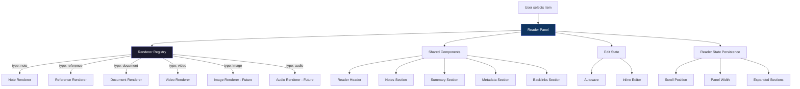
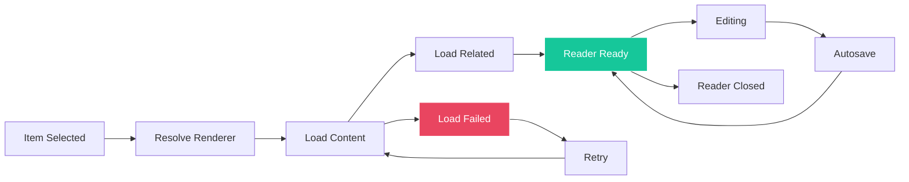
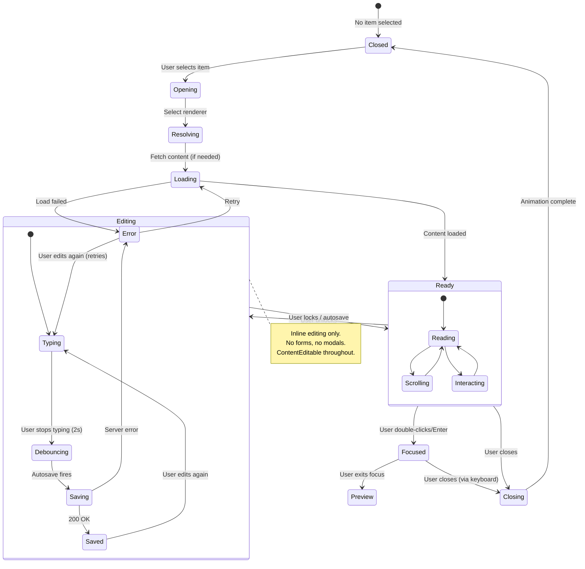

# RFC-005: Reader Architecture

**Status:** Draft
**Author:** Devventory Architecture
**Date:** 2026-07-09
**Supersedes:** Implicit reader patterns in `resource-reader-panel.tsx`, `readers/` directory, `inline-editor.tsx`

---

## Table of Contents

1. [Objective](#objective)
2. [First Principles](#first-principles)
3. [What the Reader Is](#what-the-reader-is)
4. [What the Reader Is Not](#what-the-reader-is-not)
5. [Architecture Overview](#architecture-overview)
6. [Renderer Registry](#renderer-registry)
7. [Renderer Interface](#renderer-interface)
8. [Reader Lifecycle](#reader-lifecycle)
9. [State Machine](#state-machine)
10. [Reader Modes](#reader-modes)
11. [Shared Reader Components](#shared-reader-components)
12. [Reader Templates](#reader-templates)
13. [Editing Architecture](#editing-architecture)
14. [Reader State Persistence](#reader-state-persistence)
15. [Reader Toolbar](#reader-toolbar)
16. [Responsive Behaviour](#responsive-behaviour)
17. [Performance](#performance)
18. [Current State Assessment](#current-state-assessment)
19. [Migration Path](#migration-path)
20. [Future Features](#future-features)
21. [Known Tradeoffs](#known-tradeoffs)
22. [Success Criteria](#success-criteria)

---

## Objective

Design the Reader subsystem — the primary surface for consuming, editing, and connecting with Knowledge.

This RFC defines:

- How the Reader selects and renders Knowledge through a **Renderer Registry**
- How Renderers integrate through a **common interface**
- How the Reader transitions between **modes** (browsing, preview, focus, editing)
- How editing works consistently across all Knowledge types
- How state is preserved across sessions
- How future renderers (image, audio, snippet, email) are added without refactoring

**The Reader already exists with 4 renderers. This RFC defines the architecture that future renderers extend without modifying existing code.**

---

## First Principles

### Principle 1: The Reader consumes Knowledge. It does nothing else.

The Reader renders, reads, edits, annotates, and connects. It does NOT search, capture, manage collections, authenticate, or run AI. Those responsibilities belong to their respective subsystems.

### Principle 2: Renderers are registered, not selected by conditionals.

The Reader never contains `switch(item.type)` or `if (type === "video")`. A Renderer Registry maps Knowledge types to Renderers. Adding a new type means registering a Renderer — no Reader refactoring.

### Principle 3: Every Knowledge type deserves a native experience.

A reference is not a note. A video is not a document. Each type has a distinct reading pattern. The Reader adapts to the type — the user never adapts to the Reader.

### Principle 4: Editing is inline, everywhere.

The Reader never introduces forms, modals, or textareas for editing. ContentEditable (via TipTap/ProseMirror) is the universal editing surface. Lock/unlock toggles edit mode. Autosave persists automatically.

### Principle 5: The Reader preserves context.

Scroll position, panel width, expanded sections, and edit state persist across mode switches and reopenings. The Reader restores the exact experience the user left.

---

## What the Reader Is

The Reader is the component that:

- **Renders** Knowledge content according to its type
- **Edits** titles, content, notes, and tags inline
- **Annotates** with user notes and metadata
- **Connects** through backlinks and related Knowledge
- **Remembers** state across sessions

Every Knowledge Item opens in the Reader. There is no "open in new tab" equivalent — the Reader is the single destination.

### What the Reader Feels Like

```
Reference Reader:
┌─────────────────────────────────────┐
│ [← Close] [★] [✎ Edit] [...]        │  ← Toolbar
├─────────────────────────────────────┤
│                                     │
│  Open original → github.com/...     │  ← Hero
│  # Title                            │
│  GitHub Repo  •  2 days ago         │
│                                     │
│  Summary ─────────────────────────  │  ← AI summary
│  This article explains how...       │
│                                     │
│  Why I Saved This ────────────────  │  ← User notes
│  Needed this for the auth module    │  (InlineEditor)
│                                     │
│  Referenced in 3 items ───────────  │  ← Backlinks
│  • Auth implementation notes        │
│  • Project: Frontend Auth           │
│                                     │
│  Metadata ─────────────────────────  │
│  ● reference  react.dev  #react     │
└─────────────────────────────────────┘

Note Reader:
┌─────────────────────────────────────┐
│ [← Close] [★] [✎ Edit] [...]        │
├─────────────────────────────────────┤
│                                     │
│           # My Note Title            │  ← Centered, max-w-2xl
│                                     │
│           Start writing...           │  ← InlineEditor (full width)
│                                     │
│           ─ ─ ─ ─ ─ ─ ─ ─ ─        │
│                                     │
│           Why I Saved This          │  ← Notes (below fold)
│                                     │
│           Metadata                   │
│           ● note  #ideas #react     │
└─────────────────────────────────────┘
```

---

## What the Reader Is Not

| Not responsible | Belongs to | Why |
|----------------|------------|-----|
| Search | Search Engine | The Reader opens what the user selected. Search finds what the user hasn't selected. |
| Collections | Collection subsystem | Items are in Collections. The Reader shows which ones. It does not manage them. |
| Capture | Capture Pipeline | The Reader never creates new Knowledge. It edits existing. |
| Authentication | Auth subsystem | User is already authenticated when they reach the Reader. |
| AI generation | AI Pipeline | The Reader displays AI-generated summaries. It does not generate them. |
| State machine | Knowledge lifecycle | The Reader shows status (processing, ready, archived). It does not transition states. |

---

## Architecture Overview



### Why Registry Instead of Switch

A `switch(item.type)` in `resource-reader-panel.tsx` requires editing the Reader every time a new Knowledge type is added. A Renderer Registry maps types to renderers at initialization time:

```typescript
// Current (bad):
switch (item.type) {
  case "note": return <NoteReader ... />;
  case "document": return <DocumentReader ... />;
  case "video": return <VideoReader ... />;
  default: return <ReferenceReader ... />;
}

// Future (good):
const Renderer = registry.get(item.type) || registry.get("reference");
return <Renderer {...shared} />;
```

New renderers register themselves. The Reader never changes.

---

## Renderer Registry

### Interface

```typescript
interface RendererDefinition {
  type: string;                    // Knowledge type this renderer handles
  component: React.ComponentType<RendererProps>;  // The renderer component
  priority?: number;               // For fallback chains (default: 0)
}

class RendererRegistry {
  private renderers = new Map<string, RendererDefinition>();

  register(def: RendererDefinition): void {
    this.renderers.set(def.type, def);
  }

  get(type: string): React.ComponentType<RendererProps> | null {
    return this.renderers.get(type)?.component ?? null;
  }

  getWithFallback(type: string): React.ComponentType<RendererProps> {
    return this.renderers.get(type)?.component
      ?? this.renderers.get("reference")?.component  // Generic fallback
      ?? DefaultRenderer;
  }
}
```

### Registration

```typescript
// readers/reference/renderer.tsx
import { registry } from "./registry";

registry.register({
  type: "reference",
  component: ReferenceRenderer,
});

// readers/note/renderer.tsx
registry.register({
  type: "note",
  component: NoteRenderer,
});

// etc.
```

The registry is populated at module import time (lazy-loaded with the reader panel).

### Default Fallback

If no renderer is registered for a type, the `reference` renderer is used as the generic fallback. This ensures that unknown types (e.g., future `image` before its renderer is built) still have a readable view.

### Current Registration

| Type | Renderer | Capabilities |
|------|----------|--------------|
| `reference` | ReferenceRenderer | Hero, summary, notes, backlinks, metadata, tags |
| `note` | NoteRenderer | Centered content, notes, backlinks, metadata, tags |
| `document` | DocumentRenderer | Word count, read time, full content, notes, backlinks, metadata |
| `video` | VideoRenderer | YouTube embed, summary, notes, backlinks, metadata |
| `link` | ReferenceRenderer | Same as reference |
| `tweet` | ReferenceRenderer | Same as reference |
| `pdf` | DocumentRenderer | Same as document |
| `image` | — | Future |
| `audio` | — | Future |
| `snippet` | — | Future |
| `email` | — | Future |

---

## Renderer Interface

### Props

Every renderer receives the same props:

```typescript
interface RendererProps {
  // Knowledge data
  item: KnowledgeItem;

  // Edit state (lifted to parent)
  editTitle: string;
  editContent: string | null;
  editNotes: string;
  editTags: string;
  onEditTitle: (title: string) => void;
  onEditContent: (content: string | null) => void;
  onEditNotes: (notes: string) => void;
  onEditTags: (tags: string) => void;

  // Mode
  locked: boolean;
  focusMode: boolean;

  // Styling
  blended: string;  // "opacity-50 pointer-events-none" when unlocked

  // Actions
  onTagClick: (tag: string) => void;
  onClose: () => void;
}
```

### What Each Renderer Renders

| Section | Reference | Note | Document | Video |
|---------|-----------|------|----------|-------|
| Hero (title + source) | Yes | Title only | Title + stats | Title + embed |
| Summary | Yes | — | Yes | Yes |
| Content body | Optional | Required | Required | — |
| Notes (InlineEditor) | Yes | Yes | Yes | Yes |
| Backlinks | Yes | Yes | Yes | Yes |
| Metadata (tags, date) | Yes | Yes | Yes | Yes |

### Capabilities Declaration

Each renderer declares what it supports:

```typescript
interface RendererCapabilities {
  hasContent?: boolean;       // Has a content body to edit
  hasSummary?: boolean;       // Shows AI summary section
  hasHero?: boolean;          // Shows hero with source link
  hasNotes?: boolean;         // Shows notes section
  hasBacklinks?: boolean;     // Shows backlinks
  hasMetadata?: boolean;      // Shows metadata section
  hasEmbed?: boolean;         // Shows embedded media (video, audio, image)
  editorPlaceholder?: string; // "Start writing..." for notes
}
```

The parent panel can use capabilities to skip sections without the renderer needing conditional logic. However, the renderer controls its own layout — capabilities are documentation/optimization hints, not rendering constraints.

---

## Reader Lifecycle



### Phase Details

#### 1. Item Selected

The user clicks an item in the ResourceList (preview mode) or double-clicks/presses Enter (focus mode). The item's `id` is set in the URL as `?id=`.

#### 2. Resolve Renderer

The Reader Panel reads `item.type` and looks up the Renderer Registry:

```typescript
const Renderer = registry.getWithFallback(item.type);
```

#### 3. Load Content

If the item is not in the initial fetch (e.g., loaded via search from a different page), the content is fetched from the server. For items already in the initial items array, this step is skipped (content is already in memory).

#### 4. Load Related

Backlinks and metadata are fetched in parallel (non-blocking). The reader renders immediately with available data and fills in related sections as they arrive.

#### 5. Reader Ready

The renderer is rendered with the item's data. The user can read, scroll, and interact. The toolbar shows the item's status.

#### 6. Editing

User toggles lock → enters edit mode. Title, content, and notes become editable via InlineEditor. The `blended` class is applied to the locked content as a visual cue.

#### 7. Autosave

Two seconds after the last edit, the autosave hook triggers a server action to persist changes. Status indicator shows "Saving..." → "Saved" or "Error".

#### 8. Reader Closed

User clicks the close button, selects a different item, or presses Escape. Scroll position is persisted. The reader panel slides out.

### Transitions

| From | To | Trigger | Notes |
|------|----|---------|-------|
| Idle | Selected | User clicks item | Reader not yet mounted |
| Selected | Resolving | Immediately | Synchronous — registry lookup |
| Resolving | Loading | Renderer found | Transition is instant |
| Loading | Ready | Content loaded | May be instant (initial fetch) or delayed (server fetch) |
| Loading | Failed | Network error | Show error state with retry |
| Failed | Loading | User retries | — |
| Ready | Editing | User toggles lock | Content remains visible with blended overlay |
| Editing | Ready | User locks / autosave completes | Edits saved |
| Ready | Closed | User closes/selects different item | State persisted |

---

## State Machine



### State Descriptions

| State | What happens | UI |
|-------|-------------|-----|
| **Closed** | No reader visible. Search/Collection/List is the primary view. | Empty space or list fills panel |
| **Opening** | Item selected, reader mounting | SlideInRight animation |
| **Resolving** | Looking up renderer for item type | Not user-visible (synchronous) |
| **Loading** | Fetching additional content if not in memory | Skeleton or spinner in reader panel |
| **Ready** | Content rendered, user can read/interact | Full reader UI |
| **Editing** | User is modifying content | Blended overlay on locked content, InlineEditor active |
| **Focused** | Full-width reader, explorer collapsed | Explorer at 0 width, reader fills panel |
| **Error** | Content failed to load | Error message with retry button |
| **Closing** | Reader panel animating out | SlideInRight reverse animation |

---

## Reader Modes

### Mode Definitions

| Mode | Explorer Width | Reader Width | Trigger | Purpose |
|------|---------------|--------------|---------|---------|
| **Browsing** | Full | 0 (hidden) | No item selected | Browse list/search results |
| **Preview** | Flex (50%) | 460px | Single click | Quick glance at content |
| **Focus** | 0 (hidden) | Full | Double-click / Enter | Deep reading |
| **Editing** | Same as current | Same as current | Toggle lock | Content modification |

### Mode Transitions

```
Browsing
  ↓ (click item)
Preview
  ↓ (double-click / Enter)   ↓ (close / Escape)
Focus                        Preview
  ↓ (close / Escape)         ↓ (click different item)
Preview                      Preview (new item)
  ↓ (toggle lock)
Editing (in preview or focus)
  ↓ (toggle lock)
Preview or Focus
```

### Context Preservation

- **Preview → Focus**: Scroll position saved, explorer collapsed, reader expands
- **Focus → Preview**: Explorer restored, scroll position restored
- **Preview → Preview (new item)**: Scroll position saved per item
- **Editing → Locked**: Content saved, scroll position stays

### Why Mode Is Not a Route

Mode is UI state, not navigation. The URL only tracks `?id=` and `?filter=`. Mode is React state in `knowledge-workspace.tsx`. This prevents browser history clutter and ensures smooth transitions.

---

## Shared Reader Components

### Component Hierarchy

```
Reader Panel
├── Reader Header (toolbar)
│   ├── Close / Back button
│   ├── Item type icon + title
│   ├── Favorite toggle
│   ├── Lock/Edit toggle
│   ├── Save status indicator
│   ├── More menu (delete, open original)
│   └── [Focus mode: Exit focus button replaces Close]
│
├── Renderer Content (type-specific)
│   ├── Hero section (varies by type)
│   ├── Content body (varies by type)
│   └── [Type-specific sections]
│
├── Notes Section  (shared)
│   ├── "Why I Saved This" header
│   └── InlineEditor (editable markdown)
│
├── Summary Section (shared)
│   ├── "Summary" header
│   └── AI-generated summary text
│
├── Backlinks Section (shared)
│   └── Referenced-in list with links
│
└── Metadata Section (shared)
    ├── Type dot + label
    ├── Domain / provider
    ├── Created / updated date
    └── Tag pills (editable via TagInput)
```

### Component Responsibility

| Component | Responsibility | Conditional rendering |
|-----------|---------------|----------------------|
| **Reader Header** | Toolbar: close, favorite, lock/unlock, delete, save status | Focus mode hides close, shows "Exit focus" |
| **Renderer Content** | Type-specific layout (hero, content, embed) | Everything below this is shared |
| **Notes Section** | Editable "why I saved this" field | Hidden if locked AND empty |
| **Summary Section** | AI-generated summary display | Hidden if null/empty |
| **Backlinks Section** | Title-mention backlinks, fetched async | Hidden if zero results |
| **Metadata Section** | Type, domain, date, tags | Always visible |

### How Sections Are Composed

The `reader-sections.tsx` exports individual section components. Each renderer imports the sections it needs and places them in its layout:

```typescript
// Reference Renderer layout
function ReferenceRenderer({ item, ...props }: RendererProps) {
  return (
    <div>
      <HeroSection item={item} ... />
      <SummarySection summary={item.summary} />
      {item.content && <ContentSection content={item.content} ... />}
      <NotesSection notes={props.editNotes} ... />
      <BacklinksSection title={item.title} excludeId={item.id} />
      <MetadataSection item={item} ... />
    </div>
  );
}

// Note Renderer layout (different order, centered)
function NoteRenderer({ item, ...props }: RendererProps) {
  return (
    <div className="max-w-2xl mx-auto px-8 py-8">
      <TitleSection title={props.editTitle} ... />
      <ContentSection content={props.editContent} ... />
      <hr />
      <NotesSection notes={props.editNotes} ... />
      <BacklinksSection title={item.title} excludeId={item.id} />
      <MetadataSection item={item} ... />
    </div>
  );
}
```

Each renderer controls its own layout. Shared sections are imported and placed. The renderer decides order, spacing, and which sections to include.

---

## Reader Templates

### Reference Reader

```
┌──────────────────────────────────────┐
│ Toolbar                               │
├──────────────────────────────────────┤
│                                       │
│  Open original → github.com/...       │
│                                       │
│  # How to build a React app           │
│  ● reference  GitHub  •  2d ago       │
│                                       │
│  ─── Summary ──────────────────────── │
│  This guide walks through...          │
│                                       │
│  ─── Content ──────────────────────── │
│  (If content exists, rendered as MD)  │
│                                       │
│  ─── Why I Saved This ─────────────── │
│  [InlineEditor — user notes]          │
│                                       │
│  ─── Referenced in 2 items ────────── │
│  • Auth implementation notes          │
│  • Project: Frontend Auth             │
│                                       │
│  ─── Metadata ─────────────────────── │
│  ● reference  react.dev  #react #auth │
│                                       │
└──────────────────────────────────────┘
```

**Used by types:** `reference`, `link`, `tweet`, any unregistered type

### Note Reader

```
┌──────────────────────────────────────┐
│ Toolbar                               │
├──────────────────────────────────────┤
│                                       │
│          # My Note Title               │
│                                       │
│          content                       │
│          [InlineEditor]               │
│          content                       │
│                                       │
│          ─ ─ ─ ─ ─ ─ ─ ─ ─ ─ ─ ─     │
│                                       │
│          ─── Notes ─────────────────  │
│          (optional)                   │
│                                       │
│          ─── Metadata ──────────────  │
│          ● note  #ideas  #react       │
│                                       │
└──────────────────────────────────────┘
```

**Used by types:** `note`

Key differences from other readers:
- Centered layout (`max-w-2xl mx-auto`)
- No summary section
- No hero with source link
- Title is larger (text-2xl vs text-xl)
- Content is primary — "Start writing..." placeholder
- Divider before notes/metadata

### Document Reader

```
┌──────────────────────────────────────┐
│ Toolbar                               │
├──────────────────────────────────────┤
│                                       │
│  # Document Title                     │
│  📄 document  •  2,400 words  •  12 min read
│                                       │
│  ─── Summary ──────────────────────── │
│  AI-generated summary                 │
│                                       │
│  ─── Content ──────────────────────── │
│  [Full content — Markdown reader or   │
│   InlineEditor for editing]           │
│                                       │
│  ─── Why I Saved This ─────────────── │
│  [InlineEditor]                       │
│                                       │
│  ─── Referenced in... ─────────────── │
│  • ...                                │
│                                       │
│  ─── Metadata ─────────────────────── │
│  ● document  #research  #pdf          │
│                                       │
└──────────────────────────────────────┘
```

**Used by types:** `document`, `pdf`

Key differences:
- Word count + read time in header
- Full content section with InlineEditor for content editing
- Summary section

### Video Reader

```
┌──────────────────────────────────────┐
│ Toolbar                               │
├──────────────────────────────────────┤
│                                       │
│  ┌────────────────────────────────┐   │
│  │        YouTube Embed (16:9)     │   │
│  │        <iframe>                 │   │
│  └────────────────────────────────┘   │
│                                       │
│  # Video Title                        │
│  🎬 video  YouTube  •  3d ago         │
│  Open original → youtube.com/...      │
│                                       │
│  ─── Summary ──────────────────────── │
│  AI-generated summary                 │
│                                       │
│  ─── Why I Saved This ─────────────── │
│  [InlineEditor]                       │
│                                       │
│  ─── Referenced in... ─────────────── │
│                                       │
│  ─── Metadata ─────────────────────── │
│  ● video  #tutorial  #react           │
│                                       │
└──────────────────────────────────────┘
```

**Used by types:** `video`

Key differences:
- 16:9 iframe embed at top
- No content body
- "Open original" link
- Film icon + type label

### Future Templates

| Type | Template | Key Difference |
|------|----------|----------------|
| **Image** | Image Viewer | Full-width image with zoom/pan, no content body |
| **Audio** | Audio Player | Embedded audio player with waveform, no content body |
| **Snippet** | Snippet Viewer | Code block with syntax highlighting, language badge, copy button |
| **Email** | Email Reader | From/to/subject header, thread view, attachment list |

---

## Editing Architecture

### Current Architecture

The Reader uses a **lock/unlock** pattern:

1. **Locked** (default): Content is read-only, rendered as Markdown/HTML. User reads.
2. **Unlocked**: Content is editable via TipTap InlineEditor. A `blended` CSS class (`opacity-50 pointer-events-none`) is applied to the locked-content wrapper, providing a visual cue that editing is active below.

```typescript
// Locked: show rendered markdown
{locked ? (
  <Markdown className="note-prose">{item.content}</Markdown>
) : (
  // Unlocked: show blended overlay + editor
  <>
    <div className={blended}>
      <Markdown className="note-prose">{item.content}</Markdown>
    </div>
    <InlineEditor
      content={editContent}
      onChange={onEditContent}
      editable={!locked}
    />
  </>
)}
```

### Autosave Flow

```
User edits content
  ↓
onChange fires (every keystroke)
  ↓
useAutosave hook starts 2s debounce timer
  ↓
No new edits for 2s:
  ↓
saveNow() called:
  ↓
Server action editKnowledgeItem(id, formData)
  ↓
Success → status = "saved"
Error   → status = "error" (retry on next edit)
```

### What Is Editable

| Field | Editor | Server Action |
|-------|--------|---------------|
| Title | `<input>` (controlled) | `editKnowledgeItem` |
| Content | InlineEditor (TipTap) | `editKnowledgeItem` |
| Notes | InlineEditor (TipTap) | `editKnowledgeItem` |
| Tags | TagInput (chips + autocomplete) | `editKnowledgeItem` |
| Summary | Not editable (AI-generated) | — |
| URL | Not editable (immutable source) | — |

### Editing Invariants

1. Editing is always inline. No forms, no modals, no separate edit page.
2. Title is a controlled input, not a contenteditable. It has a dedicated onChange handler.
3. Content and Notes use TipTap InlineEditor. They share the same editor component with different props.
4. Tags use TagInput with server-side autocomplete. Max 3 tags per item.
5. Autosave debounces at 2s. The status indicator shows "Saving...", "Saved", or "Error".
6. Switching items while editing discards unsaved changes (autosave fires before navigation).
7. Locking the reader triggers an immediate save (`saveNow()`) before disabling edits.

### Why TipTap (ProseMirror)

The current InlineEditor uses TipTap because:
- ContentEditable with structured document model (not raw innerHTML)
- Extensible via plugins (headings, lists, tables, links, code blocks)
- Markdown input/output via `marked` + `turndown`
- Slash commands and toolbar for formatting
- Same editing experience across all readers

No other editor library is under consideration. TipTap is the standard.

---

## Reader State Persistence

### What Is Persisted

| State | Storage | Scope | Restoration |
|-------|---------|-------|-------------|
| Scroll position | `sessionStorage` | Per item ID | On item reopen within same session |
| Panel width | `localStorage` | Global | On page load |
| Lock/Edit state | React state | Per session | Not persisted (defaults to locked) |
| Expanded sections | React state | Per session | Not persisted |
| Edit content (unsaved) | React state | Per item | Discarded on navigation |
| Edit content (saved) | Server | Permanent | Loaded from DB on item open |

### Scroll Position Strategy

```typescript
// Saved when closing reader or switching items
const scrollPositions = useRef<Map<string, number>>(new Map());

function handleClose() {
  scrollPositions.current.set(item.id, readerRef.current.scrollTop);
  closeReader();
}

// Restored when opening reader
useEffect(() => {
  const saved = scrollPositions.current.get(item.id);
  if (saved !== undefined) {
    readerRef.current.scrollTop = saved;
  }
}, [item.id]);
```

### Panel Width Strategy

The reader panel width (460px in preview mode) is stored in `localStorage` so the user's preference persists across sessions:

```typescript
const [panelWidth, setPanelWidth] = useState(() => {
  return parseInt(localStorage.getItem("reader-panel-width") || "460");
});
```

---

## Reader Toolbar

### Default State (Locked, Preview)

```
[←]  [★]  [✎ Edit]  [...]          [Saving...]
```

| Element | Action | Visibility |
|---------|--------|------------|
| Close (←) | Close reader, return to list | Always |
| Favorite (★) | Toggle favorite | Always |
| Edit (✎) | Unlock for editing | Always |
| More (...) | Dropdown: Delete, Open Original | Always |
| Save status | "Saved" / "Saving..." / "Error" | Only when editing |

### Focus Mode

```
[← Exit focus]  [★]  [✎ Edit]  [...]  [Saved]
```

Close button becomes "Exit focus" in focus mode. Clicking returns to preview mode without closing the reader.

### Editing Mode

```
[←]  [★]  [🔒 Lock]  [...]  [Saving...]
```

- Edit button becomes Lock button
- Save status is always visible
- Delete is available in More menu

### Toolbar Rules

1. The toolbar is always visible (sticky top).
2. No toolbar item opens a modal (except More menu dropdown).
3. Favorite is optimistic — toggles immediately, rolls back on error.
4. Save status is subtle — a small text label, not a toast.
5. Focus mode only changes the close button — everything else stays.

---

## Responsive Behaviour

### Layout Matrix

| Viewport | Layout | Explorer | Reader | Context Panel |
|----------|--------|----------|--------|---------------|
| ≥1280px (Large Desktop) | 3-panel | 220px | Flex | 320px (future) |
| ≥1024px (Desktop) | 2-panel | 220px | Flex | Hidden |
| ≥768px (Tablet) | Drawer + Reader | Drawer (slide-in) | Full | Hidden |
| <768px (Mobile) | Reader First | Hidden (swipeable) | Full | Hidden |

### Breakpoint Behaviour

| Breakpoint | Explorer | Reader |
|------------|----------|--------|
| ≥1024px | Fixed sidebar (220px) | Remaining width (flex) |
| 768–1023px | Slide-in drawer (toggle via hamburger) | Full width |
| <768px | Hidden (swipeable gesture) | Full width, back button navigates to list |

### Focus Mode

In focus mode on all viewports:
- Explorer collapses to 0 width
- Reader fills the panel
- A floating "Show sidebar" button appears (tablet/mobile)

---

## Performance

### Current Performance Profile

| Operation | Current | Target |
|-----------|---------|--------|
| Reader mount (in-memory item) | ~50ms | <50ms |
| Reader mount (server fetch) | ~200ms | <150ms |
| Autosave save | ~100ms | <100ms |
| Backlinks fetch | ~50ms | <50ms |
| InlineEditor init | ~80ms | <50ms |

### Optimization Rules

1. **No unnecessary rerenders.** The reader panel uses `useMemo` for sections that don't change.
2. **Virtualize backlinks list** when >20 items.
3. **Lazy-load renderers.** Each renderer is a separate chunk loaded only when its type is selected.
4. **Co-locate data fetching.** Backlinks and related content fetch in parallel during the "Load Related" phase.
5. **Preserve InlineEditor state.** The editor instance is not recreated when switching between locked/unlocked (TipTap supports `editable` toggle).
6. **Debounce autosave.** 2s debounce prevents rapid-fire server requests during typing.

### Virtualization Strategy

| Component | When to virtualize | Library |
|-----------|-------------------|---------|
| Backlinks list | >20 items | IntersectionObserver + windowing (custom, lightweight) |
| Content body | >100KB rendered | Not yet — deferred |
| Tags | >20 tags | Not applicable (max 3 per item) |

---

## Current State Assessment

### What Exists

| Component | File | Status |
|-----------|------|--------|
| **Reader Panel** (entry point) | `resource-reader-panel.tsx` | Functional — manages edit state, autosave, mode switching |
| **Reader Header** | `readers/reader-header.tsx` | Functional — toolbar with close, favorite, lock, delete, save status |
| **Reference Renderer** | `readers/reference-reader.tsx` | Functional — hero, summary, content, notes, backlinks, metadata |
| **Note Renderer** | `readers/note-reader.tsx` | Functional — centered layout, content-first |
| **Document Renderer** | `readers/document-reader.tsx` | Functional — word count, read time, full content |
| **Video Renderer** | `readers/video-reader.tsx` | Functional — YouTube embed, summary, notes |
| **Notes Section** | `readers/reader-sections.tsx` | Functional — InlineEditor with lock/edit |
| **Summary Section** | `readers/reader-sections.tsx` | Functional — AI summary display |
| **Metadata Section** | `readers/reader-sections.tsx` | Functional — type, domain, date, editable tags |
| **Backlinks Section** | `readers/reader-sections.tsx` | Functional — wrapper around Backlinks component |
| **Inline Editor** | `shared/inline-editor.tsx` | Functional — TipTap with toolbar, markdown I/O |
| **Backlinks** | `shared/backlinks.tsx` | Functional — async fetch, type-colored badges |
| **Tag Input** | `shared/tag-input.tsx` | Functional — autocomplete, max 3, keyboard nav |
| **Autosave Hook** | `hooks/use-autosave.ts` | Functional — 2s debounce, status tracking |

### What Exists But Has Gaps

| Component | Gap | Severity |
|-----------|-----|----------|
| **Renderer selection** | Uses `switch(item.type)` — adding a new type requires editing this file | Medium — violates Principle 2 |
| **KnowledgeItemType interface** | Duplicated in 7 files — no shared type | Low — causes drift |
| **Reader state persistence** | Scroll position uses React ref (lost on page navigation) | Medium — context loss |
| **Panel width persistence** | Hardcoded 460px — no user-resizable panel | Low |
| **Content virtualization** | Not implemented — large markdown files render entirely | Low |

### What Does NOT Exist

| Feature | Priority | Notes |
|---------|----------|-------|
| Renderer Registry | Medium | Currently a switch statement |
| Image Renderer | Low | No `image` type items in use |
| Audio Renderer | Low | No `audio` type items in use |
| Snippet Renderer | Low | No `snippet` type items in use |
| Email Renderer | Low | No `email` type items in use |
| Reader state persistence (scroll) | Medium | Use `sessionStorage` per item ID |
| Resizable panel | Low | Drag handle at panel edge |
| Focus mode keyboard navigation | Low | Arrow keys to navigate items while focused |

---

## Migration Path

### Phase 1: Shared Types (Current Sprint)

```
1. Extract KnowledgeItemType to packages/types:
   packages/types/src/knowledge-item.ts
   - Single source of truth interface
   - Imported by all 7 consumer files

2. Create RendererRegistry:
   src/lib/reader/registry.ts
   - register(), get(), getWithFallback()
   - Default fallback to reference renderer

3. Update resource-reader-panel.tsx:
   - Replace switch with registry.getWithFallback()
   - Import renderers in registry at module level
```

### Phase 2: Renderer Registration (Next)

```
4. Each renderer registers itself:
   readers/reference/renderer.tsx exports + registry.register(...)
   readers/note/renderer.tsx exports + registry.register(...)
   etc.

5. Lazy-load renderers:
   - Dynamic import per type
   - Only load the renderer when its type is selected
```

### Phase 3: Reader State Persistence (Next+)

```
6. Scroll position in sessionStorage:
   - Save on close/navigate
   - Restore on open
   - Keyed by item.id

7. Panel width in localStorage:
   - Drag handle at panel edge
   - Persist across sessions

8. Expanded sections in React state:
   - Per-session only (not persisted)
```

### Phase 4: Future Renderers (As Needed)

```
9. Image Renderer:
   - Full-width image with zoom/pan
   - No content body
   - Register as type: "image"

10. Audio Renderer:
    - Embedded audio player
    - Waveform visualization (future)
    - Register as type: "audio"

11. Snippet Renderer:
    - Code block with syntax highlighting
    - Language badge, copy button
    - Register as type: "snippet"

12. Email Renderer:
    - From/to/subject header
    - Thread view
    - Attachment list
    - Register as type: "email"
```

---

## Future Features

### Reserved But Not Implemented

| Feature | How it fits | What needs to change |
|---------|-------------|---------------------|
| **Highlights** | User selects text → highlight persisted as annotation on KnowledgeItem | Add highlight model (itemId, text, color, createdAt). Renderer shows highlights in content body. |
| **Annotations** | User adds margin notes on specific content sections | Extend highlight with annotation text. Display as tooltip or sidebar note. |
| **Comments** | User adds comment thread on item (like Google Docs) | Add Comment model (itemId, userId, text, parentId for threading). Reader renders comment thread below content or in sidebar panel. |
| **Version History** | Track content changes over time | Add KnowledgeVersion model (snapshot of content/notes). Reader shows timeline of versions. |
| **AI Assistant** | Ask questions about the content inline | Reader panel includes an AI chat section. Uses existing `/api/ext/ai-enrich` endpoint or new chat endpoint. |
| **Reader Themes** | Sepia, dark, light, monochrome reading modes | CSS variables for theme colors. Theme persisted in localStorage. No renderer changes needed. |
| **Read Later** | Temporary queue of items to read | No Reader change needed — "Read Later" is a Smart Collection (status-based filter). |
| **Reading Statistics** | Words read, time spent, items completed per day | Activity log already tracks `lastOpenedAt`. Reader reports scroll depth and time-on-page to activity log. |

### Why No Architecture Change Is Needed

All future features extend the Reader by:
1. **Adding new sections** (Highlights, Annotations, AI Chat appear as sections in the reader layout)
2. **Extending the toolbar** (new buttons in Reader Header's More menu)
3. **Adding new models** (Highlight, Comment, KnowledgeVersion sit alongside KnowledgeItem)
4. **Registering new renderers** (SnippetRenderer, ImageRenderer, AudioRenderer, EmailRenderer implement the same RendererProps interface)

The Reader's core architecture — Renderer Registry + shared sections + inline editing + autosave — remains stable.

---

## Known Tradeoffs

### Tradeoff 1: Switch statement vs. Registry

**Current:** `switch(item.type)` in `resource-reader-panel.tsx`
**Designed:** Renderer Registry with `register()` / `get()`

**Why switch exists:** The registry pattern was not designed before the initial 4 renderers were built. Adding a registry now requires moving the selection logic to a separate module.

**Why registry is better:** Adding a new renderer requires zero changes to existing code. The registry is a map, not a conditional chain. Dynamic imports are cleaner.

**Migration cost:** ~30 lines of changes in `resource-reader-panel.tsx` + one new file (`lib/reader/registry.ts`).

### Tradeoff 2: Inline editing vs. dedicated edit view

**Chosen:** Inline editing (TipTap with lock/unlock toggle).
**Alternative:** Dedicated edit page (separate route, form-based).

**Why inline:** Preserves context. The user sees exactly what will be saved. No navigation away from the content. No "preview" vs. "edit" mode mismatch.

**Downside:** TipTap adds ~15KB to the reader bundle. Not all content types benefit from WYSIWYG (code snippets work better as plaintext). The `blended` overlay CSS trick is a workaround for React's rendering model — the editor is always mounted below the locked content, just invisible when locked.

### Tradeoff 3: Per-renderer layout vs. unified layout

**Chosen:** Each renderer controls its own layout. Shared sections are imported.
**Alternative:** A single `<Reader>` component that conditionally includes sections.

**Why per-renderer:** Different types have fundamentally different reading patterns. A note's centered, distraction-free layout is incompatible with a reference's hero-first layout. A single component with conditional sections would accumulate type-specific logic.

**Downside:** Duplication of layout structure across renderers. Notes and summaries sections are wrapped in the same card styling but each renderer provides it. Mitigated by extracting shared section components (`reader-sections.tsx`).

### Tradeoff 4: Autosave on lock vs. continuous autosave

**Chosen:** Continuous autosave (2s debounce) + explicit save on lock.
**Alternative:** Save only on lock (no continuous autosave).

**Why continuous:** Users expect their work to be saved without thinking about it. A 2s debounce is long enough to batch keystrokes, short enough that users don't worry about losing edits.

**Downside:** More server writes (every 2s of typing). Mitigated by the 2s debounce — rapid typing only produces one save after the user pauses.

### Tradeoff 5: Shared KnowledgeItemType vs. local interfaces

**Current:** 7 local interfaces (duplicated).
**Designed:** Single shared type in `packages/types`.

**Why local:** Historical — the types package was not set up when the reader was built. Changing one interface requires updating 7 files.

**Why shared:** Single source of truth. Adding a field (like `wordCount` for documents) requires one change, not seven.

**Migration cost:** Extract interface → update 7 imports → verify no field drift. Low risk.

---

## Success Criteria

After reading this RFC, an engineer should be able to answer:

### How does the Reader work?
The Reader Panel resolves a Renderer from the Renderer Registry based on the item's type. The selected Renderer renders type-specific content (hero, embed, body) and imports shared sections (notes, summary, backlinks, metadata). The toolbar provides close, favorite, lock/edit, and delete actions. Autosave persists edits with a 2s debounce.

### How do renderers integrate?
Each renderer implements the `RendererProps` interface and registers itself with the Registry via `registry.register({ type, component })`. The registry maps types to components. The Reader Panel calls `registry.getWithFallback(item.type)` to select the renderer. No switch statements.

### How are new Knowledge types supported?
Create a new renderer component implementing `RendererProps`. Register it with the Registry for the new type. Import shared sections as needed. The Reader Panel automatically selects the new renderer. No changes to existing renderers or the Reader Panel.

### How does editing work?
The Reader has two modes: locked (read-only) and unlocked (editable). In unlocked mode, TipTap InlineEditor replaces rendered content. Title is a controlled `<input>`. Content and Notes are TipTap editors. Tags use TagInput. Autosave fires 2s after the last edit. Locking triggers an immediate save.

### How is state preserved?
Scroll position is saved to `sessionStorage` per item ID and restored on reopen. Panel width is saved to `localStorage`. Lock/edit state is per-session only. Expanded sections are per-session. Saved content is persisted on the server and loaded from the database on open.

### How does the Reader evolve?
New features (highlights, annotations, AI assistant, themes) add sections or toolbar items without changing the core architecture. New renderers (image, audio, snippet, email) register themselves without modifying existing code. The Renderer Registry, shared sections, InlineEditor, and autosave remain stable.

### What are the four reader modes?
- **Browsing**: No item selected, explorer fills the panel
- **Preview**: Single click opens reader at 460px alongside explorer
- **Focus**: Double-click/Enter collapses explorer, reader fills panel
- **Editing**: Lock/unlock toggle in any mode, inline content editing
